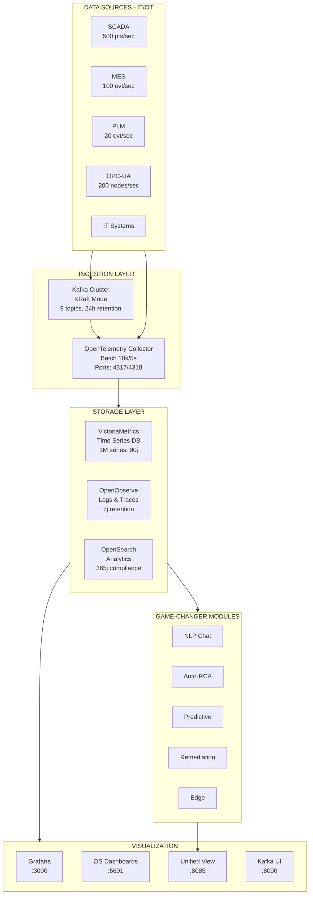
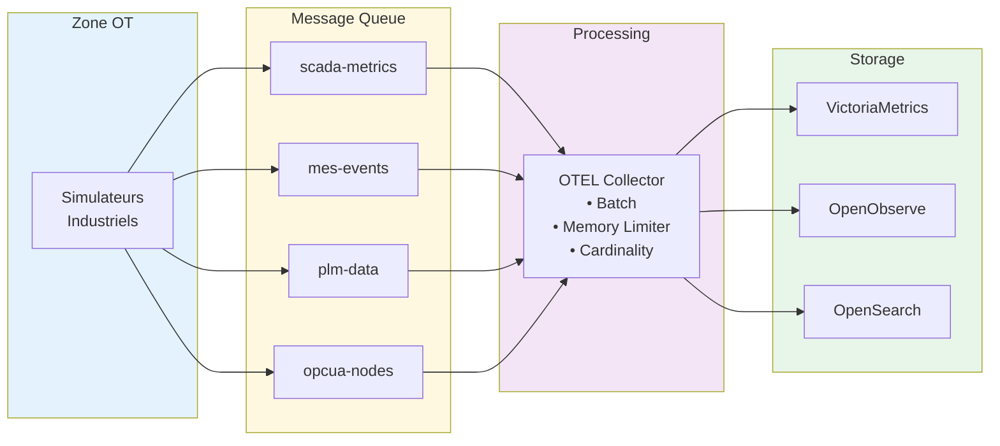
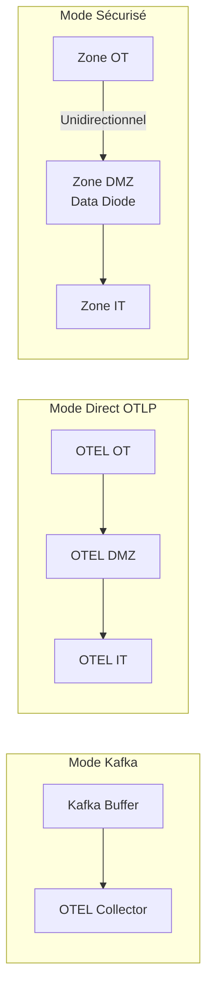
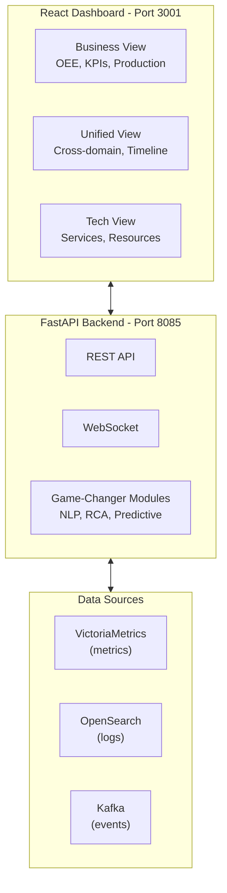

# SYNAPSIX - Industrial Observability Platform

**O**penObserve + **V**ictoria**M**etrics + Open**TEL**emetry + OpenSearch + Kafka

Plateforme d'observabilité haute performance optimisée pour les environnements industriels (SCADA, MES, PLM, OPC-UA) avec support du streaming continu IT/OT à grande échelle.

> **Documentation complète:** [docs/ARCHITECTURE.md](docs/ARCHITECTURE.md)

## Architecture Globale



## Flux de Données IT/OT



## Composants

| Composant | Rôle | Port | Capacité |
|-----------|------|------|----------|
| **Kafka** | Buffer de messages pour streaming haute volumétrie | 9092, 9093 | 10GB, 24h retention |
| **Victoria Metrics** | Base de données time-series haute performance | 8428 | 1M séries, 90j retention |
| **OpenObserve** | Logs et traces (alternative légère à Elasticsearch) | 5080 | Cache 1GB |
| **OpenSearch** | Analytics full-text et corrélation | 9200 | Cluster scalable |
| **OTEL Collector** | Pipeline de télémétrie central | 4317, 4318 | 10k batch, 2GB memory |
| **Grafana** | Visualisation unifiée | 3000 | Multi-datasource |

## Modes de Déploiement

OOVMTEL propose trois modes de déploiement:

| Mode | Fichier | Description |
|------|---------|-------------|
| **Standard (Kafka)** | `docker-compose.yml` | Architecture complète avec Kafka |
| **Direct OTLP** | `docker-compose.direct-otlp.yml` | Sans Kafka, 90% moins de ressources |
| **Sécurisé (IEC 62443)** | `docker-compose.ot/dmz/it.yml` | Séparation IT/OT avec data diode |



> **Voir:** [docs/DIRECT_OTLP_ARCHITECTURE.md](docs/DIRECT_OTLP_ARCHITECTURE.md) | [docs/SECURE_ARCHITECTURE.md](docs/SECURE_ARCHITECTURE.md)

## Démarrage Rapide

### Prérequis

- Docker 24.0+
- Docker Compose v2.20+
- 16GB RAM minimum (32GB recommandé pour production)
- 50GB d'espace disque

### Installation

```bash
# Cloner le repository
git clone <repository-url>
cd OOVMTEL

# Démarrer la plateforme
./scripts/start.sh

# Vérifier le statut
./scripts/status.sh
```

### Arrêt

```bash
# Arrêter tous les services
./scripts/stop.sh

# Nettoyage complet (supprime les données)
./scripts/cleanup.sh
```

## Accès aux Services

| Service | URL | Credentials |
|---------|-----|-------------|
| **Unified Business-Tech View** | http://localhost:8085 | - |
| **Grafana** | http://localhost:3000 | admin / admin123 |
| **OpenObserve** | http://localhost:5080 | root@example.com / Complexpass#123 |
| **OpenSearch Dashboards** | http://localhost:5601 | - |
| **Kafka UI** | http://localhost:8090 | - |
| **Victoria Metrics** | http://localhost:8428 | - |
| **OTEL Collector Health** | http://localhost:13133 | - |
| **OTEL zPages** | http://localhost:55679 | - |

## Unified Business-Tech View

The platform includes a comprehensive **Unified Business-Tech View** that provides a single-pane-of-glass experience for both business stakeholders and technical teams.

### Features

**Business View:**
- Overall Equipment Effectiveness (OEE) monitoring
- Production KPIs (quality rate, cycle time, defects)
- Equipment status and health monitoring
- Real-time alarm tracking
- Process parameters visualization (temperature, pressure, power, vibration)

**Tech View:**
- Service health status for all platform components
- Resource utilization (CPU, memory, disk)
- Data pipeline metrics (ingestion rates, latency, error rates)
- Storage metrics (VictoriaMetrics, OpenSearch, Kafka)
- OTEL Collector throughput monitoring

**Security & Compliance:**
- Multi-framework compliance tracking (ISO 27001, SOC 2, GDPR, NIS 2, AI Act)
- Video surveillance integration with live camera feeds
- Security events timeline with severity levels
- Vulnerability scanning and threat detection

**EU Regulations Compliance:**
- **AI Act** - Risk classification, AI systems inventory, compliance requirements tracking
- **NIS 2** - Entity type classification, cybersecurity requirements, incident reporting

**Unified Insights:**
- Cross-domain correlation between business and tech events
- Real-time event timeline combining both domains
- Automatic metric aggregation and visualization

### Access

The Unified View is available at: **http://localhost:8085**

### Architecture



### Grafana Dashboards

Pre-configured Grafana dashboards are available at **http://localhost:3000**:

| Dashboard | Description |
|-----------|-------------|
| **Welcome Hub** | Default home dashboard with platform overview and quick navigation |
| **AI Observability** | ML model monitoring, inference metrics, AI pipeline health |
| **Industrial Control Center** | SCADA/MES/PLM unified monitoring |
| **Real-Time Streaming** | Kafka throughput, data pipeline metrics |
| **System Health Overview** | Infrastructure health and resource utilization |
| **Unified Business-Tech View** | Combined business KPIs and technical metrics |

## Injection de Données

### Via OTLP (Recommandé)

```python
from opentelemetry import trace, metrics
from opentelemetry.exporter.otlp.proto.grpc.trace_exporter import OTLPSpanExporter
from opentelemetry.exporter.otlp.proto.grpc.metric_exporter import OTLPMetricExporter

# Configuration
OTEL_ENDPOINT = "localhost:4317"

# Traces
trace.set_tracer_provider(TracerProvider())
trace.get_tracer_provider().add_span_processor(
    BatchSpanProcessor(OTLPSpanExporter(endpoint=OTEL_ENDPOINT, insecure=True))
)

# Metrics
metrics.set_meter_provider(MeterProvider(
    metric_readers=[PeriodicExportingMetricReader(
        OTLPMetricExporter(endpoint=OTEL_ENDPOINT, insecure=True)
    )]
))
```

### Via Kafka (Haute Volumétrie)

```python
from kafka import KafkaProducer
import json

producer = KafkaProducer(
    bootstrap_servers=['localhost:9093'],
    value_serializer=lambda v: json.dumps(v).encode('utf-8'),
    compression_type='lz4'
)

# Envoyer des données SCADA
producer.send('scada-metrics', {
    'timestamp': '2024-01-15T10:30:00Z',
    'tag_id': 'SCADA.ZONE_A.REACTOR_001.TEMP',
    'value': 75.5,
    'unit': '°C',
    'quality': 'good'
})
```

### Via Prometheus Remote Write

```yaml
# prometheus.yml
remote_write:
  - url: http://localhost:8428/api/v1/write
```

### Via API OpenObserve

```bash
# Envoyer des logs
curl -X POST "http://localhost:5080/api/default/industrial/_json" \
  -H "Content-Type: application/json" \
  -u "root@example.com:Complexpass#123" \
  -d '[{
    "timestamp": "2024-01-15T10:30:00Z",
    "level": "INFO",
    "source": "scada",
    "message": "Temperature reading normal",
    "equipment_id": "reactor_001"
  }]'
```

## Simulateurs Industriels

La plateforme inclut des simulateurs réalistes pour les tests :

| Simulateur | Type | Débit | Topics Kafka |
|------------|------|-------|--------------|
| SCADA | Capteurs temps réel | 500 pts/sec | scada-metrics |
| MES | Événements production | 100 evt/sec | mes-events |
| PLM | Données engineering | 20 evt/sec | plm-data |
| OPC-UA | Nœuds OPC-UA | 200 nodes/sec | opcua-nodes |

### Métriques Générées

**SCADA:**
- `scada_temperature_celsius` - Température
- `scada_pressure_bar` - Pression
- `scada_flow_rate_m3h` - Débit
- `scada_level_percent` - Niveau de cuve
- `scada_vibration_mms` - Vibration
- `scada_power_kw` - Consommation électrique
- `scada_alarms_total` - Alarmes

**MES:**
- `mes_production_count_total` - Production
- `mes_cycle_time_seconds` - Temps de cycle
- `mes_oee_percent` - OEE (Overall Equipment Effectiveness)
- `mes_quality_rate_percent` - Taux qualité
- `mes_defects_total` - Défauts

**PLM:**
- `plm_changes_total` - Modifications
- `plm_approval_time_hours` - Temps d'approbation
- `plm_active_revisions` - Révisions actives

## Configuration Avancée

### Scaling Kafka

```yaml
# docker-compose.override.yml
services:
  kafka:
    environment:
      KAFKA_NUM_PARTITIONS: 24
      KAFKA_DEFAULT_REPLICATION_FACTOR: 3
```

### Haute Disponibilité Victoria Metrics

```yaml
# Pour cluster Victoria Metrics
services:
  vmselect:
    image: victoriametrics/vmselect
  vminsert:
    image: victoriametrics/vminsert
  vmstorage:
    image: victoriametrics/vmstorage
```

### Optimisation OTEL Collector

```yaml
# config/otel/otel-collector-config.yaml
processors:
  batch:
    send_batch_size: 20000  # Augmenter pour haute volumétrie
    timeout: 2s
  memory_limiter:
    limit_mib: 4096  # Augmenter pour plus de buffer
```

## Monitoring de la Plateforme

### Métriques Internes

- **OTEL Collector:** http://localhost:8888/metrics
- **Victoria Metrics:** http://localhost:8428/metrics
- **Kafka JMX:** Port 7071 (si activé)

### Dashboards Grafana Recommandés

1. **Welcome Hub** - Dashboard d'accueil avec navigation rapide (défaut)
2. **AI Observability** - Monitoring ML et inférence IA
3. **Industrial Control Center** - Vue unifiée SCADA/MES/PLM
4. **Real-Time Streaming** - Débit Kafka et pipelines
5. **System Health Overview** - Santé infrastructure

## Troubleshooting

### Kafka ne démarre pas

```bash
# Vérifier les logs
docker compose logs kafka

# Augmenter la mémoire si nécessaire
# Dans docker-compose.yml, modifier KAFKA_HEAP_OPTS
```

### OTEL Collector en erreur

```bash
# Vérifier la configuration
docker compose exec otel-collector cat /etc/otel/config.yaml

# Voir les erreurs
docker compose logs otel-collector --tail 100
```

### Victoria Metrics surchargé

```bash
# Vérifier les métriques
curl http://localhost:8428/api/v1/status/tsdb

# Augmenter les limites si nécessaire
```

## Performance Attendue

| Métrique | Valeur |
|----------|--------|
| Ingestion métriques | 100k+ points/sec |
| Ingestion logs | 50k+ events/sec |
| Rétention métriques | 90 jours |
| Rétention logs | 30 jours |
| Latence requête (p99) | < 500ms |
| Latence ingestion (p99) | < 100ms |

## Sécurité (Production)

Pour un déploiement en production, activer :

1. **TLS/SSL** sur tous les endpoints
2. **Authentification** Kafka (SASL)
3. **RBAC** OpenSearch
4. **Network Policies** Kubernetes
5. **Encryption at rest**

## Licence

MIT License

## Support

Pour les questions ou problèmes, ouvrir une issue sur le repository.
