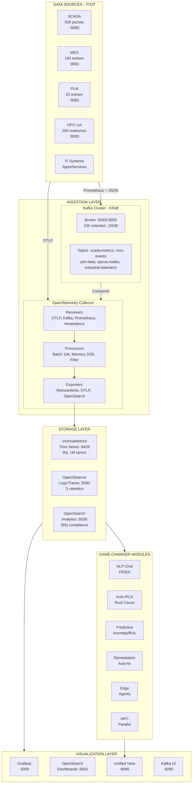
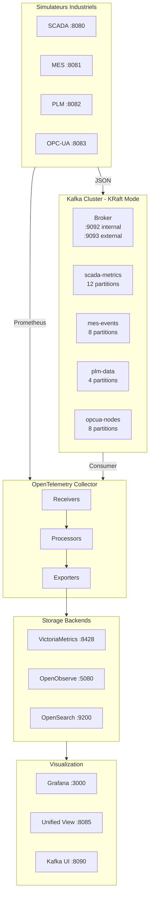
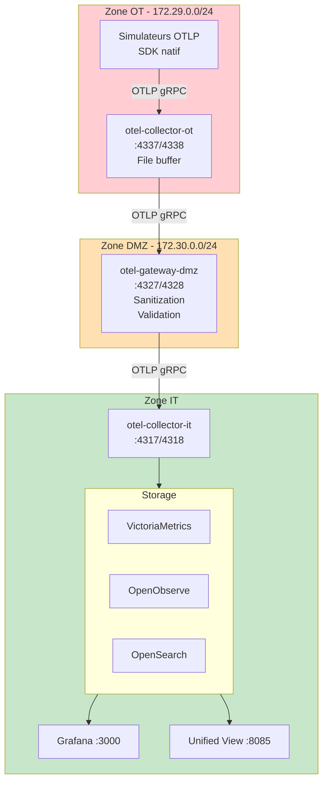
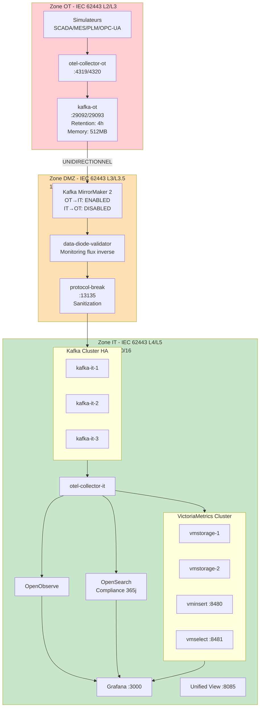
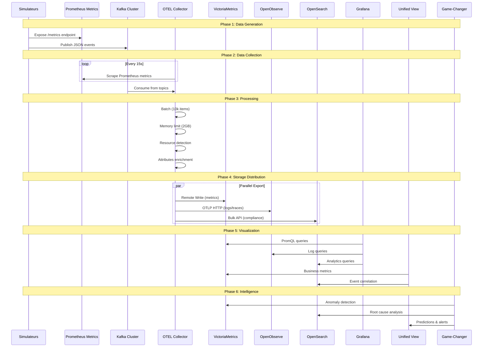

# OOVMTEL - Architecture Technique Complète

## Vue d'Ensemble

**OOVMTEL** = **O**penObserve + **V**ictoria**M**etrics + Open**TEL**emetry + OpenSearch + Kafka

Plateforme d'observabilité industrielle haute performance pour environnements IT/OT critiques.

| Capacité | Valeur |
|----------|--------|
| Ingestion métriques | 100k+ points/sec |
| Ingestion logs | 50k+ events/sec |
| Rétention métriques | 90 jours |
| Rétention compliance | 365 jours |
| Latence ingestion (p99) | < 100ms |
| Latence requête (p99) | < 500ms |
| Séries temporelles max | 1M actives |

---

## Architecture Globale Détaillée

```
┌─────────────────────────────────────────────────────────────────────────────────────────┐
│                                    OOVMTEL PLATFORM                                      │
├─────────────────────────────────────────────────────────────────────────────────────────┤
│                                                                                          │
│  ┌─────────────────────────────────────────────────────────────────────────────────┐    │
│  │                         DATA SOURCES (IT/OT Layer)                               │    │
│  │  ┌──────────┐  ┌──────────┐  ┌──────────┐  ┌──────────┐  ┌──────────────────┐   │    │
│  │  │  SCADA   │  │   MES    │  │   PLM    │  │  OPC-UA  │  │   IT Systems     │   │    │
│  │  │ 500pt/s  │  │ 100ev/s  │  │  20ev/s  │  │ 200nd/s  │  │  Apps, Services  │   │    │
│  │  │  :8080   │  │  :8081   │  │  :8082   │  │  :8083   │  │                  │   │    │
│  │  └────┬─────┘  └────┬─────┘  └────┬─────┘  └────┬─────┘  └────────┬─────────┘   │    │
│  └───────┼─────────────┼─────────────┼─────────────┼─────────────────┼─────────────┘    │
│          │             │             │             │                 │                   │
│          │ Prometheus  │ Prometheus  │ Prometheus  │ Prometheus      │ OTLP             │
│          │ + JSON      │ + JSON      │ + JSON      │ + JSON          │                   │
│          ▼             ▼             ▼             ▼                 ▼                   │
│  ┌─────────────────────────────────────────────────────────────────────────────────┐    │
│  │                         INGESTION LAYER                                          │    │
│  │                                                                                   │    │
│  │  ┌─────────────────────────────────┐    ┌─────────────────────────────────────┐  │    │
│  │  │         KAFKA CLUSTER           │    │      OPENTELEMETRY COLLECTOR        │  │    │
│  │  │         (KRaft Mode)            │    │                                     │  │    │
│  │  │  ┌─────────────────────────┐    │    │  Receivers:                         │  │    │
│  │  │  │ Topics:                 │    │    │  ├─ OTLP gRPC    :4317              │  │    │
│  │  │  │ • scada-metrics (12p)  │    │    │  ├─ OTLP HTTP    :4318              │  │    │
│  │  │  │ • mes-events (8p)      │    │    │  ├─ Prometheus   scrape             │  │    │
│  │  │  │ • plm-data (4p)        │    │    │  ├─ Kafka        consumer           │  │    │
│  │  │  │ • opcua-nodes (8p)     │    │    │  ├─ Hostmetrics  system             │  │    │
│  │  │  │ • industrial-telem(12p)│    │    │  └─ Filelog      /var/log           │  │    │
│  │  │  └─────────────────────────┘    │    │                                     │  │    │
│  │  │  Port: 9092 (int) / 9093 (ext)  │    │  Processors:                        │  │    │
│  │  │  Retention: 24h / 10GB          │    │  ├─ Batch        10k/5s             │  │    │
│  │  └─────────────────────────────────┘    │  ├─ Memory       2GB limit          │  │    │
│  │                    │                     │  ├─ Resource     detection          │  │    │
│  │                    │ Kafka Consumer      │  ├─ Attributes   enrichment         │  │    │
│  │                    └─────────────────────┼──┤ Filter        noise              │  │    │
│  │                                          │  └─ Transform    normalize          │  │    │
│  │                                          │                                     │  │    │
│  │                                          │  Health: :13133  Metrics: :8888     │  │    │
│  │                                          └──────────────────┬──────────────────┘  │    │
│  └─────────────────────────────────────────────────────────────┼────────────────────┘    │
│                                                                 │                        │
│                    ┌────────────────────────────────────────────┼───────────────┐        │
│                    │                                            │               │        │
│                    ▼                                            ▼               ▼        │
│  ┌─────────────────────────────────────────────────────────────────────────────────┐    │
│  │                              STORAGE LAYER                                       │    │
│  │                                                                                   │    │
│  │  ┌─────────────────────┐  ┌─────────────────────┐  ┌─────────────────────────┐   │    │
│  │  │   VICTORIAMETRICS   │  │     OPENOBSERVE     │  │       OPENSEARCH        │   │    │
│  │  │                     │  │                     │  │                         │   │    │
│  │  │  Type: Time Series  │  │  Type: Logs/Traces  │  │  Type: Full-text/Audit  │   │    │
│  │  │  Port: 8428         │  │  Port: 5080         │  │  Port: 9200             │   │    │
│  │  │  Retention: 90j     │  │  Retention: 7j      │  │  Retention: 365j        │   │    │
│  │  │  Series: 1M max     │  │  Cache: 512MB       │  │  Compliance: IEC 62443  │   │    │
│  │  │                     │  │                     │  │                         │   │    │
│  │  │  API:               │  │  API:               │  │  API:                   │   │    │
│  │  │  • PromQL           │  │  • SQL              │  │  • Query DSL            │   │    │
│  │  │  • MetricsQL        │  │  • OTLP             │  │  • Bulk                 │   │    │
│  │  │  • Remote Write     │  │  • JSON ingest      │  │  • Aggregations         │   │    │
│  │  └─────────────────────┘  └─────────────────────┘  └─────────────────────────┘   │    │
│  └─────────────────────────────────────────────────────────────────────────────────┘    │
│                    │                        │                       │                    │
│                    └────────────────────────┼───────────────────────┘                    │
│                                             │                                            │
│                                             ▼                                            │
│  ┌─────────────────────────────────────────────────────────────────────────────────┐    │
│  │                           VISUALIZATION LAYER                                    │    │
│  │                                                                                   │    │
│  │  ┌─────────────┐  ┌─────────────────┐  ┌─────────────────┐  ┌─────────────────┐  │    │
│  │  │   GRAFANA   │  │    OPENSEARCH   │  │   UNIFIED VIEW  │  │    KAFKA UI     │  │    │
│  │  │             │  │    DASHBOARDS   │  │                 │  │                 │  │    │
│  │  │  Port: 3000 │  │   Port: 5601    │  │   Port: 8085    │  │   Port: 8090    │  │    │
│  │  │             │  │                 │  │                 │  │                 │  │    │
│  │  │  Dashboards:│  │  • Analytics    │  │  • Business KPI │  │  • Topics       │  │    │
│  │  │  • SCADA    │  │  • Exploration  │  │  • Tech Metrics │  │  • Consumers    │  │    │
│  │  │  • MES      │  │  • Compliance   │  │  • Timeline     │  │  • Messages     │  │    │
│  │  │  • Pipeline │  │  • Alerting     │  │  • Correlations │  │  • Partitions   │  │    │
│  │  │  • AI/ML    │  │                 │  │  • NLP Chat     │  │                 │  │    │
│  │  └─────────────┘  └─────────────────┘  └────────┬────────┘  └─────────────────┘  │    │
│  └─────────────────────────────────────────────────┼───────────────────────────────┘    │
│                                                     │                                    │
│                                                     ▼                                    │
│  ┌─────────────────────────────────────────────────────────────────────────────────┐    │
│  │                         GAME-CHANGER MODULES                                     │    │
│  │                                                                                   │    │
│  │  ┌───────────┐  ┌───────────┐  ┌───────────┐  ┌───────────┐  ┌───────────────┐   │    │
│  │  │    NLP    │  │  AUTO-RCA │  │ PREDICTIVE│  │REMEDIATION│  │     EDGE      │   │    │
│  │  │   CHAT    │  │           │  │           │  │           │  │               │   │    │
│  │  │           │  │ Root Cause│  │ Anomaly   │  │ Runbook   │  │ Agent Manager │   │    │
│  │  │ FR/EN     │  │ Analysis  │  │ Detection │  │ Executor  │  │ Sync Manager  │   │    │
│  │  │ PromQL Gen│  │ Causal    │  │ RUL Pred  │  │ Auto-fix  │  │ Aggregation   │   │    │
│  │  │ Intent    │  │ Graph     │  │ Trending  │  │ Approval  │  │ Compression   │   │    │
│  │  └───────────┘  └───────────┘  └───────────┘  └───────────┘  └───────────────┘   │    │
│  │                                                                                   │    │
│  │  ┌─────────────────────────────────────────────────────────────────────────────┐ │    │
│  │  │                          HPC ENGINE                                         │ │    │
│  │  │  • Cluster Manager    • Parallel Processor    • Simulation Engine           │ │    │
│  │  │  • Batch Processing   • Optimization Solver   • Resource Scheduler          │ │    │
│  │  └─────────────────────────────────────────────────────────────────────────────┘ │    │
│  └─────────────────────────────────────────────────────────────────────────────────┘    │
│                                                                                          │
└─────────────────────────────────────────────────────────────────────────────────────────┘
```

---

## Schéma Mermaid - Architecture Complète



---

## Trois Modes de Déploiement

### Vue Comparative

```
┌─────────────────────────────────────────────────────────────────────────────────────┐
│                         MODES DE DÉPLOIEMENT OOVMTEL                                 │
├─────────────────────────────────────────────────────────────────────────────────────┤
│                                                                                      │
│  MODE 1: STANDARD (Kafka)              MODE 2: DIRECT-OTLP           MODE 3: SECURE │
│  docker-compose.yml                    docker-compose.direct-otlp    IEC 62443      │
│                                                                                      │
│  ┌─────────────────┐                   ┌─────────────────┐          ┌─────────────┐ │
│  │   Simulateurs   │                   │   Simulateurs   │          │  Zone OT    │ │
│  └────────┬────────┘                   │   (OTLP natif)  │          │  L2/L3      │ │
│           │                            └────────┬────────┘          │  Kafka Edge │ │
│           ▼                                     │                   └──────┬──────┘ │
│  ┌─────────────────┐                           │                          │        │
│  │  Kafka Cluster  │                           ▼                          ▼        │
│  │  Buffer 24h     │                   ┌─────────────────┐          ┌─────────────┐ │
│  └────────┬────────┘                   │ OTEL Collector  │          │  Zone DMZ   │ │
│           │                            │      OT         │          │  L3/L3.5    │ │
│           ▼                            │   :4337/4338    │          │ MirrorMaker │ │
│  ┌─────────────────┐                   └────────┬────────┘          │ Data Diode  │ │
│  │ OTEL Collector  │                            │                   └──────┬──────┘ │
│  │   :4317/4318    │                            ▼                          │        │
│  └────────┬────────┘                   ┌─────────────────┐                 ▼        │
│           │                            │  OTEL Gateway   │          ┌─────────────┐ │
│           ▼                            │      DMZ        │          │  Zone IT    │ │
│  ┌─────────────────┐                   │   :4327/4328    │          │  L4/L5      │ │
│  │    Storage      │                   │  Sanitization   │          │ Kafka HA x3 │ │
│  │  VM + OO + OS   │                   └────────┬────────┘          │ VM Cluster  │ │
│  └─────────────────┘                            │                   └─────────────┘ │
│                                                 ▼                                    │
│  Mémoire: ~15GB                        ┌─────────────────┐          Mémoire: ~25GB  │
│  CPU: Moyenne                          │ OTEL Collector  │          CPU: Élevée     │
│  Replay: OUI                           │      IT         │          Conformité: OUI │
│                                        │   :4317/4318    │                          │
│                                        └────────┬────────┘                          │
│                                                 │                                    │
│                                                 ▼                                    │
│                                        ┌─────────────────┐                          │
│                                        │    Storage      │                          │
│                                        └─────────────────┘                          │
│                                                                                      │
│                                        Mémoire: ~5GB                                │
│                                        CPU: Faible                                  │
│                                        Replay: NON                                  │
│                                                                                      │
└─────────────────────────────────────────────────────────────────────────────────────┘
```

### Mode 1: Architecture Standard (Kafka)



**Fichier:** `docker-compose.yml`

**Services (13):**
| Service | Port | Rôle |
|---------|------|------|
| kafka | 9092/9093 | Message broker |
| victoria-metrics | 8428 | Time series DB |
| vmagent | 8429 | Prometheus scraper |
| openobserve | 5080 | Logs & traces |
| opensearch | 9200 | Full-text search |
| opensearch-dashboards | 5601 | Analytics UI |
| otel-collector | 4317/4318 | Telemetry pipeline |
| grafana | 3000 | Dashboards |
| unified-view | 8085 | Business-Tech view |
| scada-simulator | 8080 | SCADA data gen |
| mes-simulator | 8081 | MES data gen |
| plm-simulator | 8082 | PLM data gen |
| opcua-simulator | 8083 | OPC-UA data gen |

---

### Mode 2: Architecture Direct-OTLP (Sans Kafka)



**Fichier:** `docker-compose.direct-otlp.yml`

**Avantages:**
- 90% moins de ressources (pas de Kafka)
- OTLP end-to-end
- File-based buffering (persistance)
- Séparation IT/OT/DMZ

---

### Mode 3: Architecture Sécurisée (IEC 62443)



**Fichiers:**
- `docker-compose.ot.yml` - Zone OT
- `docker-compose.dmz.yml` - Zone DMZ
- `docker-compose.it.yml` - Zone IT

**Conformité IEC 62443:**
- Niveau 2/3: Zone OT (réseau interne isolé)
- Niveau 3/3.5: Zone DMZ (data diode)
- Niveau 4/5: Zone IT (haute disponibilité)

---

## Architecture OpenTelemetry Collector

```
┌─────────────────────────────────────────────────────────────────────────────────────┐
│                        OPENTELEMETRY COLLECTOR PIPELINE                              │
├─────────────────────────────────────────────────────────────────────────────────────┤
│                                                                                      │
│  ┌─────────────────────────────────────────────────────────────────────────────┐    │
│  │                              RECEIVERS                                       │    │
│  │                                                                               │    │
│  │  ┌─────────────┐  ┌─────────────┐  ┌─────────────┐  ┌─────────────────────┐  │    │
│  │  │    OTLP     │  │  PROMETHEUS │  │    KAFKA    │  │    HOSTMETRICS      │  │    │
│  │  │             │  │             │  │             │  │                     │  │    │
│  │  │ gRPC :4317  │  │ Scrape 15s  │  │ Consumer    │  │ CPU, Memory, Disk   │  │    │
│  │  │ HTTP :4318  │  │ 4 targets   │  │ Group: otel │  │ Network, Filesystem │  │    │
│  │  │             │  │ :8080-8083  │  │ 5 topics    │  │ Interval: 60s       │  │    │
│  │  └──────┬──────┘  └──────┬──────┘  └──────┬──────┘  └──────────┬──────────┘  │    │
│  │         │                │                │                    │              │    │
│  │  ┌──────┴──────┐                                                              │    │
│  │  │   FILELOG   │                                                              │    │
│  │  │             │                                                              │    │
│  │  │ /var/log/   │                                                              │    │
│  │  │ industrial/ │                                                              │    │
│  │  └──────┬──────┘                                                              │    │
│  └─────────┼────────────────┼────────────────┼────────────────────┼──────────────┘    │
│            └────────────────┴────────────────┴────────────────────┘                   │
│                                        │                                              │
│                                        ▼                                              │
│  ┌─────────────────────────────────────────────────────────────────────────────┐    │
│  │                              PROCESSORS                                      │    │
│  │                                                                               │    │
│  │  ┌─────────────────┐  ┌─────────────────┐  ┌─────────────────────────────┐   │    │
│  │  │  MEMORY_LIMITER │  │      BATCH      │  │    RESOURCEDETECTION        │   │    │
│  │  │                 │  │                 │  │                             │   │    │
│  │  │ Limit: 2048 MiB │  │ Send: 10000     │  │ Detectors:                  │   │    │
│  │  │ Spike: 512 MiB  │  │ Max: 20000      │  │ • env                       │   │    │
│  │  │ Check: 1s       │  │ Timeout: 5s     │  │ • system                    │   │    │
│  │  └────────┬────────┘  └────────┬────────┘  │ • docker                    │   │    │
│  │           │                    │           └──────────────┬──────────────┘   │    │
│  │           │                    │                          │                   │    │
│  │  ┌────────┴────────┐  ┌────────┴────────┐  ┌──────────────┴──────────────┐   │    │
│  │  │   ATTRIBUTES    │  │     FILTER      │  │        TRANSFORM            │   │    │
│  │  │                 │  │                 │  │                             │   │    │
│  │  │ Add:            │  │ Drop metrics:   │  │ Metric normalization        │   │    │
│  │  │ • platform      │  │ • go_*          │  │ Context manipulation        │   │    │
│  │  │ • environment   │  │ • process_*     │  │ Attribute mapping           │   │    │
│  │  │ • version       │  │ (noisy metrics) │  │                             │   │    │
│  │  └────────┬────────┘  └────────┬────────┘  └──────────────┬──────────────┘   │    │
│  └───────────┴───────────────────┴───────────────────────────┴──────────────────┘    │
│                                        │                                              │
│                                        ▼                                              │
│  ┌─────────────────────────────────────────────────────────────────────────────┐    │
│  │                              EXPORTERS                                       │    │
│  │                                                                               │    │
│  │  ┌───────────────────────┐  ┌───────────────────────┐  ┌─────────────────┐   │    │
│  │  │ PROMETHEUSREMOTEWRITE │  │       OTLPHTTP        │  │   OPENSEARCH    │   │    │
│  │  │                       │  │                       │  │                 │   │    │
│  │  │ → VictoriaMetrics     │  │ → OpenObserve         │  │ → OpenSearch    │   │    │
│  │  │   :8428/api/v1/write  │  │   :5080/api/default   │  │   :9200         │   │    │
│  │  │                       │  │   Auth: Basic         │  │   Index: otel-* │   │    │
│  │  │ Metrics only          │  │   Logs + Traces       │  │   Logs + Traces │   │    │
│  │  └───────────────────────┘  └───────────────────────┘  └─────────────────┘   │    │
│  │                                                                               │    │
│  │  ┌───────────────────────┐                                                    │    │
│  │  │        DEBUG          │  Extensions:                                       │    │
│  │  │                       │  • Health check :13133                             │    │
│  │  │ Verbosity: detailed   │  • pprof        :1777                              │    │
│  │  │ Sampling: 5 initial   │  • zPages       :55679                             │    │
│  │  │ then 1/500            │                                                    │    │
│  │  └───────────────────────┘                                                    │    │
│  └─────────────────────────────────────────────────────────────────────────────┘    │
│                                                                                      │
└─────────────────────────────────────────────────────────────────────────────────────┘
```

### Pipelines Configurés

```yaml
# Pipelines OTEL
pipelines:
  metrics:
    receivers: [otlp, hostmetrics, prometheus]
    processors: [memory_limiter, resourcedetection, batch]
    exporters: [prometheusremotewrite, debug]

  logs:
    receivers: [otlp, filelog]
    processors: [memory_limiter, batch]
    exporters: [otlphttp, opensearch]

  traces:
    receivers: [otlp]
    processors: [memory_limiter, batch]
    exporters: [otlphttp, opensearch]
```

---

## Architecture des Modules Game-Changer

```
┌─────────────────────────────────────────────────────────────────────────────────────┐
│                          GAME-CHANGER MODULES ARCHITECTURE                           │
├─────────────────────────────────────────────────────────────────────────────────────┤
│                                                                                      │
│  ┌─────────────────────────────────────────────────────────────────────────────┐    │
│  │                    FASTAPI BACKEND - Port 8085                               │    │
│  │  ┌─────────────────────────────────────────────────────────────────────┐    │    │
│  │  │                         API ROUTER                                   │    │    │
│  │  │  /api/business-metrics  /api/tech-metrics  /api/unified-view        │    │    │
│  │  │  /api/nlp/query         /api/rca/incidents /api/predictive/anomalies│    │    │
│  │  │  /api/remediation/exec  /api/edge/agents   /api/hpc/simulate        │    │    │
│  │  │  /ws/metrics            /ws/logs           /health                  │    │    │
│  │  └─────────────────────────────────────────────────────────────────────┘    │    │
│  └─────────────────────────────────────────────────────────────────────────────┘    │
│                                        │                                             │
│            ┌───────────────────────────┼───────────────────────────┐                │
│            │                           │                           │                │
│            ▼                           ▼                           ▼                │
│  ┌─────────────────────┐  ┌─────────────────────┐  ┌─────────────────────────────┐  │
│  │    NLP MODULE       │  │   AUTO-RCA MODULE   │  │    PREDICTIVE MODULE        │  │
│  │    /modules/nlp/    │  │    /modules/rca/    │  │    /modules/predictive/     │  │
│  │                     │  │                     │  │                             │  │
│  │  ┌───────────────┐  │  │  ┌───────────────┐  │  │  ┌───────────────────────┐  │  │
│  │  │ engine.py     │  │  │  │ analyzer.py   │  │  │  │ anomaly_detector.py   │  │  │
│  │  │ 536 lines     │  │  │  │               │  │  │  │ Z-Score, Isolation    │  │  │
│  │  │               │  │  │  │ Temporal      │  │  │  │ Forest                │  │  │
│  │  │ - Parse query │  │  │  │ correlation   │  │  │  └───────────────────────┘  │  │
│  │  │ - Intent      │  │  │  │ analysis      │  │  │                             │  │
│  │  │ - FR/EN       │  │  │  └───────────────┘  │  │  ┌───────────────────────┐  │  │
│  │  └───────────────┘  │  │                     │  │  │ trend_analyzer.py     │  │  │
│  │                     │  │  ┌───────────────┐  │  │  │ ARIMA, Forecasting    │  │  │
│  │  ┌───────────────┐  │  │  │ graph.py      │  │  │  └───────────────────────┘  │  │
│  │  │ query_gen.py  │  │  │  │               │  │  │                             │  │
│  │  │ 274 lines     │  │  │  │ Causal graph  │  │  │  ┌───────────────────────┐  │  │
│  │  │               │  │  │  │ builder       │  │  │  │ rul_estimator.py      │  │  │
│  │  │ PromQL        │  │  │  │               │  │  │  │ Remaining Useful Life │  │  │
│  │  │ generation    │  │  │  └───────────────┘  │  │  └───────────────────────┘  │  │
│  │  └───────────────┘  │  │                     │  │                             │  │
│  │                     │  │  ┌───────────────┐  │  │  Output:                    │  │
│  │  ┌───────────────┐  │  │  │ root_cause.py │  │  │  • Anomaly alerts           │  │
│  │  │ response.py   │  │  │  │               │  │  │  • Failure predictions      │  │
│  │  │ 604 lines     │  │  │  │ Probability   │  │  │  • Maintenance windows      │  │
│  │  │               │  │  │  │ scoring       │  │  │                             │  │
│  │  │ Natural lang  │  │  │  └───────────────┘  │  └─────────────────────────────┘  │
│  │  │ response      │  │  │                     │                                   │
│  │  └───────────────┘  │  │  Output:            │                                   │
│  │                     │  │  • Root causes      │                                   │
│  │  Example:           │  │  • Timeline         │                                   │
│  │  "Température       │  │  • Recommendations  │                                   │
│  │  réacteur A?"       │  │                     │                                   │
│  │  → PromQL query     │  └─────────────────────┘                                   │
│  │  → "75.3°C"         │                                                            │
│  └─────────────────────┘                                                            │
│                                                                                      │
│  ┌─────────────────────┐  ┌─────────────────────┐  ┌─────────────────────────────┐  │
│  │ REMEDIATION MODULE  │  │    EDGE MODULE      │  │       HPC MODULE            │  │
│  │ /modules/remediation│  │   /modules/edge/    │  │      /modules/hpc/          │  │
│  │                     │  │                     │  │                             │  │
│  │  ┌───────────────┐  │  │  ┌───────────────┐  │  │  ┌───────────────────────┐  │  │
│  │  │ runbook_lib.py│  │  │  │ agent_mgr.py  │  │  │  │ cluster_manager.py    │  │  │
│  │  │               │  │  │  │               │  │  │  │ 451 lines             │  │  │
│  │  │ Pre-defined   │  │  │  │ Agent         │  │  │  │                       │  │  │
│  │  │ actions:      │  │  │  │ lifecycle     │  │  │  │ Node management       │  │  │
│  │  │ • restart_svc │  │  │  │ management    │  │  │  │ Resource allocation   │  │  │
│  │  │ • clear_queue │  │  │  └───────────────┘  │  │  └───────────────────────┘  │  │
│  │  │ • escalate    │  │  │                     │  │                             │  │
│  │  │ • shell_cmd   │  │  │  ┌───────────────┐  │  │  ┌───────────────────────┐  │  │
│  │  │ • notify      │  │  │  │ sync_mgr.py   │  │  │  │ parallel_processor.py │  │  │
│  │  └───────────────┘  │  │  │               │  │  │  │ 513 lines             │  │  │
│  │                     │  │  │ Config sync   │  │  │  │                       │  │  │
│  │  ┌───────────────┐  │  │  │ Data sync     │  │  │  │ Map-reduce            │  │  │
│  │  │ executor.py   │  │  │  │ Heartbeat     │  │  │  │ Batch processing      │  │  │
│  │  │               │  │  │  └───────────────┘  │  │  └───────────────────────┘  │  │
│  │  │ Dry-run mode  │  │  │                     │  │                             │  │
│  │  │ Approval flow │  │  │  ┌───────────────┐  │  │  ┌───────────────────────┐  │  │
│  │  │ Action log    │  │  │  │ aggregator.py │  │  │  │ simulation_engine.py  │  │  │
│  │  └───────────────┘  │  │  │               │  │  │  │ 496 lines             │  │  │
│  │                     │  │  │ Local data    │  │  │  │                       │  │  │
│  │  ┌───────────────┐  │  │  │ aggregation   │  │  │  │ Industrial simulation │  │  │
│  │  │ approval.py   │  │  │  │ Compression   │  │  │  │ What-if scenarios     │  │  │
│  │  │               │  │  │  └───────────────┘  │  │  └───────────────────────┘  │  │
│  │  │ Workflow      │  │  │                     │  │                             │  │
│  │  │ management    │  │  │  Model:             │  │  Total: 2.4k lines          │  │
│  │  └───────────────┘  │  │  EdgeAgent:         │  │                             │  │
│  │                     │  │  • agent_id         │  │                             │  │
│  │  Total: 1.4k lines  │  │  • hostname         │  │                             │  │
│  └─────────────────────┘  │  • location         │  └─────────────────────────────┘  │
│                           │  • status           │                                   │
│                           │  • last_heartbeat   │                                   │
│                           │                     │                                   │
│                           │  Total: 700 lines   │                                   │
│                           └─────────────────────┘                                   │
│                                                                                      │
│  ┌─────────────────────────────────────────────────────────────────────────────┐    │
│  │                           DATA SOURCES                                       │    │
│  │                                                                               │    │
│  │   VictoriaMetrics ──────────────────────────────────────── Metrics queries   │    │
│  │   :8428 ─────────────────────────────────────────────────── PromQL API       │    │
│  │                                                                               │    │
│  │   OpenSearch ───────────────────────────────────────────── Log queries       │    │
│  │   :9200 ─────────────────────────────────────────────────── Query DSL        │    │
│  │                                                                               │    │
│  │   OpenObserve ──────────────────────────────────────────── Real-time logs    │    │
│  │   :5080 ─────────────────────────────────────────────────── SQL queries      │    │
│  │                                                                               │    │
│  └─────────────────────────────────────────────────────────────────────────────┘    │
│                                                                                      │
└─────────────────────────────────────────────────────────────────────────────────────┘
```

---

## Flux de Données Complet



---

## Tableau Complet des Ports et Services

| Port | Service | Protocole | Description | Mode |
|------|---------|-----------|-------------|------|
| **3000** | Grafana | HTTP | Dashboards métriques | Tous |
| **4317** | OTEL Collector | gRPC | OTLP gRPC receiver | Tous |
| **4318** | OTEL Collector | HTTP | OTLP HTTP receiver | Tous |
| **4319** | OTEL Collector OT | gRPC | Zone OT receiver | Secure |
| **4320** | OTEL Collector OT | HTTP | Zone OT receiver | Secure |
| **4327** | OTEL Gateway DMZ | gRPC | DMZ gateway | Direct-OTLP |
| **4328** | OTEL Gateway DMZ | HTTP | DMZ gateway | Direct-OTLP |
| **4337** | OTEL Collector OT | gRPC | OT collector | Direct-OTLP |
| **4338** | OTEL Collector OT | HTTP | OT collector | Direct-OTLP |
| **5080** | OpenObserve | HTTP | Logs & Traces UI/API | Tous |
| **5601** | OpenSearch Dashboards | HTTP | Analytics UI | Tous |
| **8080** | SCADA Simulator | HTTP | Prometheus metrics | Tous |
| **8081** | MES Simulator | HTTP | Prometheus metrics | Tous |
| **8082** | PLM Simulator | HTTP | Prometheus metrics | Tous |
| **8083** | OPC-UA Simulator | HTTP | Prometheus metrics | Tous |
| **8085** | Unified View | HTTP | Business-Tech dashboard | Tous |
| **8090** | Kafka UI | HTTP | Kafka management | Standard/Secure |
| **8428** | VictoriaMetrics | HTTP | Time series API | Tous |
| **8429** | vmagent | HTTP | Prometheus scraper | Standard |
| **8480** | vminsert | HTTP | Cluster write endpoint | Secure |
| **8481** | vmselect | HTTP | Cluster read endpoint | Secure |
| **8888** | OTEL Collector | HTTP | Prometheus metrics | Tous |
| **9092** | Kafka | TCP | Bootstrap internal | Standard/Secure |
| **9093** | Kafka | TCP | Bootstrap external | Standard/Secure |
| **9200** | OpenSearch | HTTP | REST API | Tous |
| **13133** | OTEL Collector | HTTP | Health check | Tous |
| **29092** | Kafka OT | TCP | OT zone broker | Secure |
| **55679** | OTEL Collector | HTTP | zPages debug | Tous |

---

## Métriques Générées par les Simulateurs

### SCADA Simulator (500 pts/sec)

```prometheus
# Température des équipements
scada_temperature_celsius{equipment_id="reactor_001", zone="A", source="PT100"}

# Pression process
scada_pressure_bar{equipment_id="vessel_001", zone="B"}

# Débit de fluides
scada_flow_rate_m3h{equipment_id="pump_001", fluid="water"}

# Niveau de cuves
scada_level_percent{tank_id="tank_001", product="chemical_A"}

# Vibration (maintenance prédictive)
scada_vibration_mms{equipment_id="motor_001", axis="x"}

# Consommation électrique
scada_power_kw{equipment_id="compressor_001", phase="total"}

# Alarmes actives
scada_alarms_total{severity="CRITICAL|WARNING|INFO", area="production"}
```

### MES Simulator (100 evt/sec)

```prometheus
# Compteur de production
mes_production_count_total{product_id="SKU_001", line_id="LINE_A"}

# Temps de cycle
mes_cycle_time_seconds{line_id="LINE_A", operation="assembly"}

# OEE (Overall Equipment Effectiveness)
mes_oee_percent{equipment_id="machine_001"}
# OEE = Availability × Performance × Quality × 100

# Taux qualité
mes_quality_rate_percent{product_id="SKU_001", shift="morning"}

# Compteur de défauts
mes_defects_total{defect_type="scratch|dimension|color", product_id="SKU_001"}
```

### PLM Simulator (20 evt/sec)

```prometheus
# Modifications de conception
plm_changes_total{document_type="CAD|BOM|specification", status="pending|approved|rejected"}

# Temps d'approbation
plm_approval_time_hours{change_id="CHG_001", workflow="standard"}

# Révisions actives
plm_active_revisions{document_id="DOC_001", version="current"}
```

### OPC-UA Simulator (200 nodes/sec)

```
Nœuds OPC-UA dynamiques:
├── Objects/
│   ├── Devices/
│   │   ├── Device_001/
│   │   │   ├── Temperature (Float)
│   │   │   ├── Status (Int32)
│   │   │   └── Alarms (Boolean)
│   │   └── Device_002/
│   │       └── ...
│   └── Process/
│       ├── Parameters/
│       └── Events/
```

---

## Volumes de Persistance

```
Docker Volumes:
├── victoria_metrics_data/     # Time-series data (90j)
│   └── ~50GB typical
│
├── vmagent_data/              # Scraper queue & buffer
│   └── ~1GB max
│
├── openobserve_data/          # Logs, traces, cache
│   └── ~20GB typical
│
├── opensearch_data/           # Full-text index (365j)
│   └── ~100GB+ typical
│
├── grafana_data/              # Dashboards, plugins
│   └── ~500MB typical
│
├── industrial_logs/           # Raw application logs
│   └── ~10GB typical
│
├── [MODE SECURE - OT]
├── kafka_ot_data/             # OT zone Kafka (4h)
│   └── ~2GB max
│
├── [MODE SECURE - IT]
├── kafka_it_1_data/           # IT Kafka broker 1
├── kafka_it_2_data/           # IT Kafka broker 2
├── kafka_it_3_data/           # IT Kafka broker 3
│   └── ~30GB each
│
├── vmstorage_1_data/          # VM cluster node 1
├── vmstorage_2_data/          # VM cluster node 2
│   └── ~50GB each
│
├── [MODE DIRECT-OTLP]
├── otel_ot_buffer/            # OT file-based queue
├── otel_dmz_buffer/           # DMZ file-based queue
├── otel_it_buffer/            # IT file-based queue
│   └── ~5GB each
```

---

## Configuration Réseau

```
┌─────────────────────────────────────────────────────────────────────────────────────┐
│                              NETWORK ARCHITECTURE                                    │
├─────────────────────────────────────────────────────────────────────────────────────┤
│                                                                                      │
│  MODE STANDARD (docker-compose.yml)                                                  │
│  ┌─────────────────────────────────────────────────────────────────────────────┐    │
│  │  oovmtel_network (bridge)                                                    │    │
│  │  All services on single network                                              │    │
│  │  Internal DNS resolution                                                     │    │
│  └─────────────────────────────────────────────────────────────────────────────┘    │
│                                                                                      │
│  MODE DIRECT-OTLP (docker-compose.direct-otlp.yml)                                  │
│  ┌─────────────────────────────────────────────────────────────────────────────┐    │
│  │  ot-network (172.29.0.0/24)     │  Simulateurs + OTEL OT                    │    │
│  │  dmz-network (172.30.0.0/24)    │  OTEL Gateway DMZ                         │    │
│  │  it-network (172.31.0.0/16)     │  Storage + Visualization                  │    │
│  └─────────────────────────────────────────────────────────────────────────────┘    │
│                                                                                      │
│  MODE SECURE (IEC 62443)                                                            │
│  ┌─────────────────────────────────────────────────────────────────────────────┐    │
│  │                                                                               │    │
│  │  ┌─────────────────┐                                                         │    │
│  │  │   OT Network    │  172.29.0.0/24                                          │    │
│  │  │   internal=true │  No internet access                                     │    │
│  │  │   L2/L3         │  Simulators + Kafka-OT + OTEL-OT                        │    │
│  │  └────────┬────────┘                                                         │    │
│  │           │ Unidirectional                                                   │    │
│  │           ▼                                                                  │    │
│  │  ┌─────────────────┐                                                         │    │
│  │  │   DMZ Network   │  172.30.0.0/24                                          │    │
│  │  │   bridge        │  MirrorMaker + Data Diode + Protocol Break              │    │
│  │  │   L3/L3.5       │  Validates unidirectional flow                          │    │
│  │  └────────┬────────┘                                                         │    │
│  │           │ Validated                                                        │    │
│  │           ▼                                                                  │    │
│  │  ┌─────────────────┐                                                         │    │
│  │  │   IT Network    │  172.31.0.0/16                                          │    │
│  │  │   bridge        │  Kafka Cluster + Storage + Visualization                │    │
│  │  │   L4/L5         │  Full HA capabilities                                   │    │
│  │  └─────────────────┘                                                         │    │
│  │                                                                               │    │
│  └─────────────────────────────────────────────────────────────────────────────┘    │
│                                                                                      │
└─────────────────────────────────────────────────────────────────────────────────────┘
```

---

## Ressources Système Requises

| Mode | RAM Min | RAM Recommandée | CPU | Disque |
|------|---------|-----------------|-----|--------|
| **Standard** | 16 GB | 32 GB | 4 cores | 100 GB |
| **Direct-OTLP** | 8 GB | 16 GB | 2 cores | 50 GB |
| **Secure** | 32 GB | 64 GB | 8 cores | 200 GB |

### Détail par Service

| Service | RAM | CPU | Notes |
|---------|-----|-----|-------|
| Kafka | 4-8 GB | 1-2 | KAFKA_HEAP_OPTS |
| VictoriaMetrics | 2-4 GB | 0.5-1 | Scales with series count |
| OpenObserve | 1-2 GB | 0.5-1 | Cache-dependent |
| OpenSearch | 4-8 GB | 1-2 | JVM heap |
| OTEL Collector | 2-4 GB | 0.5-1 | memory_limiter config |
| Grafana | 512 MB | 0.2 | Dashboard complexity |
| Simulators | 256 MB each | 0.1 | 4 instances |

---

## Comparaison des Modes

| Critère | Standard (Kafka) | Direct-OTLP | Secure (IEC 62443) |
|---------|------------------|-------------|---------------------|
| **Complexité** | Moyenne | Faible | Élevée |
| **RAM totale** | ~15 GB | ~5 GB | ~25 GB |
| **Replay données** | ✅ 24h | ❌ Non | ✅ 7j+ |
| **Multi-consumer** | ✅ Oui | ❌ Non | ✅ Oui |
| **Séparation IT/OT** | ❌ Non | ⚠️ Logique | ✅ Physique |
| **Data Diode** | ❌ Non | ❌ Non | ✅ Oui |
| **Conformité** | ❌ | ❌ | ✅ IEC 62443 |
| **Haute Dispo** | ❌ | ❌ | ✅ Full HA |
| **Cas d'usage** | Dev/Test | POC | Production critique |

---

## Scripts d'Automatisation

```bash
# Démarrage
./scripts/start.sh [simple|secure|direct-otlp]

# Vérification statut
./scripts/status.sh

# Arrêt
./scripts/stop.sh

# Nettoyage complet
./scripts/cleanup.sh

# Initialisation flux de données
./scripts/data-ingestion-launcher.sh
```

---

## Accès aux Services

| Service | URL | Credentials |
|---------|-----|-------------|
| **Unified View** | http://localhost:8085 | - |
| **Grafana** | http://localhost:3000 | admin / admin123 |
| **OpenObserve** | http://localhost:5080 | root@example.com / Complexpass#123 |
| **OpenSearch Dashboards** | http://localhost:5601 | - |
| **Kafka UI** | http://localhost:8090 | - |
| **VictoriaMetrics** | http://localhost:8428 | - |
| **OTEL Health** | http://localhost:13133 | - |
| **OTEL zPages** | http://localhost:55679 | - |

---

## Stack Technologique

| Catégorie | Technologie | Version |
|-----------|-------------|---------|
| **Container** | Docker | 24.0+ |
| **Orchestration** | Docker Compose | 2.20+ |
| **Message Queue** | Kafka (KRaft) | 7.5.3 |
| **Time Series DB** | VictoriaMetrics | v1.96.0 |
| **Logs/Traces** | OpenObserve | v0.10.1 |
| **Search/Analytics** | OpenSearch | 2.11.1 |
| **Telemetry** | OpenTelemetry Collector | 0.91.0 |
| **Visualization** | Grafana | 10.2.3 |
| **Backend** | FastAPI (Python 3.11) | 0.108.0 |
| **Frontend** | React | - |

---

## Security & Compliance Module

The platform includes comprehensive security monitoring and regulatory compliance tracking.

### Video Surveillance Integration

```
┌─────────────────────────────────────────────────────────────────┐
│                    VIDEO SURVEILLANCE                            │
├─────────────────────────────────────────────────────────────────┤
│                                                                  │
│  ┌─────────────┐  ┌─────────────┐  ┌─────────────┐              │
│  │  Camera 1   │  │  Camera 2   │  │  Camera 3   │              │
│  │  Entrance   │  │  Server Rm  │  │  Warehouse  │              │
│  │  ● ONLINE   │  │  ● ONLINE   │  │  ● OFFLINE  │              │
│  │  🔴 REC     │  │  🔴 REC     │  │             │              │
│  └─────────────┘  └─────────────┘  └─────────────┘              │
│                                                                  │
│  ┌─────────────┐  ┌─────────────┐  ┌─────────────┐              │
│  │  Camera 4   │  │  Camera 5   │  │  Camera 6   │              │
│  │  Parking    │  │  Loading    │  │  Office     │              │
│  │  ● ONLINE   │  │  ● ONLINE   │  │  ● ONLINE   │              │
│  │  🔴 REC     │  │  🔴 REC     │  │  🔴 REC     │              │
│  └─────────────┘  └─────────────┘  └─────────────┘              │
│                                                                  │
│  Metrics: Online 5/6 | Recording 5 | Storage 2.4TB | 30d Ret.   │
│                                                                  │
└─────────────────────────────────────────────────────────────────┘
```

Features:
- Live camera feed monitoring (6 cameras)
- Recording status indicators
- Security event timeline (motion detection, access events)
- Storage and retention metrics
- Multi-location support

### EU Regulations Compliance

#### AI Act Compliance

```
┌─────────────────────────────────────────────────────────────────┐
│                      EU AI ACT COMPLIANCE                        │
├─────────────────────────────────────────────────────────────────┤
│                                                                  │
│  Risk Classification:                                            │
│  ┌──────────────────────────────────────────────────────────┐   │
│  │ Unacceptable │  High Risk  │   Limited   │   Minimal    │   │
│  │   ❌ None    │  ✓ 2 sys    │  ✓ 3 sys    │  ✓ 5 sys     │   │
│  └──────────────────────────────────────────────────────────┘   │
│                                                                  │
│  Requirements Progress:                           Score: 78%     │
│  ├─ Risk Management System              ████████████░░ 95%      │
│  ├─ Data Governance                     █████████░░░░░ 72%      │
│  ├─ Technical Documentation             ████████░░░░░░ 65%      │
│  ├─ Transparency Obligations            ████████████████ 100%   │
│  ├─ Human Oversight                     ██████████░░░░ 80%      │
│  ├─ Accuracy & Robustness              ████████░░░░░░ 68%      │
│  ├─ Automatic Logging                   ████████████░░ 92%      │
│  └─ Conformity Assessment              █████░░░░░░░░░ 45%      │
│                                                                  │
└─────────────────────────────────────────────────────────────────┘
```

#### NIS 2 Directive Compliance

```
┌─────────────────────────────────────────────────────────────────┐
│                    NIS 2 DIRECTIVE COMPLIANCE                    │
├─────────────────────────────────────────────────────────────────┤
│                                                                  │
│  Entity Type: Essential Services          Score: 87%             │
│                                                                  │
│  Cybersecurity Requirements:                                     │
│  ├─ Risk Analysis & Security Policies     ████████████░░ 90%    │
│  ├─ Incident Handling                     █████████████░ 95%    │
│  ├─ Business Continuity                   ██████████░░░░ 78%    │
│  ├─ Supply Chain Security                 █████████░░░░░ 72%    │
│  ├─ Network Security                      ████████████░░ 88%    │
│  ├─ Vulnerability Handling                █████████░░░░░ 70%    │
│  ├─ Cybersecurity Hygiene                 ████████████░░ 92%    │
│  ├─ Cryptography Policies                 ███████████░░░ 85%    │
│  ├─ Access Control                        █████████████░ 95%    │
│  └─ Multi-Factor Authentication           ████████████████ 100% │
│                                                                  │
│  Incident Reporting: ANSSI 24h notification enabled              │
│                                                                  │
└─────────────────────────────────────────────────────────────────┘
```

### Compliance Frameworks Overview

| Framework | Score | Status | Controls |
|-----------|-------|--------|----------|
| ISO 27001 | 94% | ✅ Compliant | 114/122 passed |
| SOC 2 Type II | 98% | ✅ Compliant | 78/81 passed |
| GDPR | 91% | ⚠️ Partial | 45/52 passed |
| NIS 2 | 87% | ⚠️ Partial | 52/62 passed |
| AI Act | 78% | ⚠️ Partial | 38/52 passed |

---

## Grafana Dashboards

Pre-configured dashboards available at http://localhost:3000:

| Dashboard | UID | Description |
|-----------|-----|-------------|
| **Welcome Hub** | welcome-hub | Default home dashboard with platform overview |
| **AI Observability** | ai-observability | ML model monitoring, inference metrics |
| **Industrial Control Center** | industrial-control-center | SCADA/MES/PLM unified view |
| **Real-Time Streaming** | realtime-streaming | Kafka throughput, data pipelines |
| **System Health Overview** | system-health-overview | Infrastructure health metrics |

---

## Références

- [OpenTelemetry Documentation](https://opentelemetry.io/docs/)
- [VictoriaMetrics Docs](https://docs.victoriametrics.com/)
- [OpenObserve Docs](https://openobserve.ai/docs/)
- [OpenSearch Documentation](https://opensearch.org/docs/)
- [Apache Kafka Documentation](https://kafka.apache.org/documentation/)
- [IEC 62443 Standard](https://www.iec.ch/cyber-security)
- [Grafana Documentation](https://grafana.com/docs/)
- [EU AI Act](https://artificialintelligenceact.eu/)
- [NIS 2 Directive](https://digital-strategy.ec.europa.eu/en/policies/nis2-directive)
