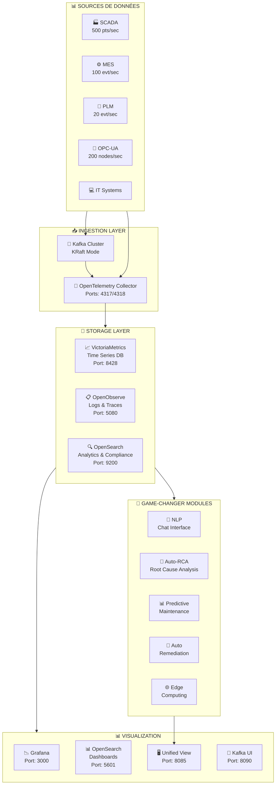
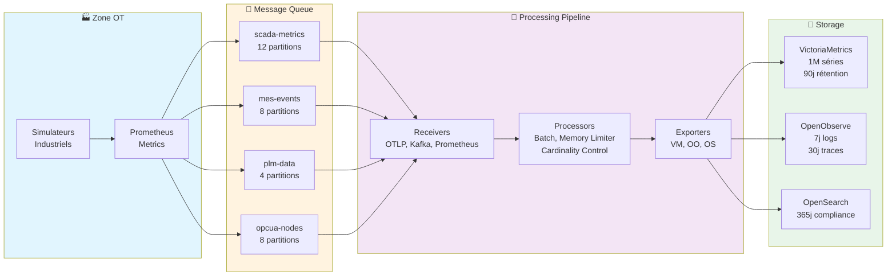
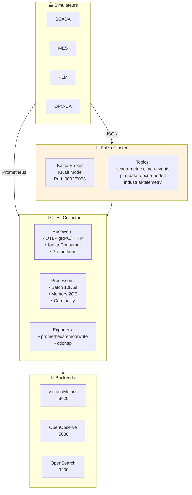
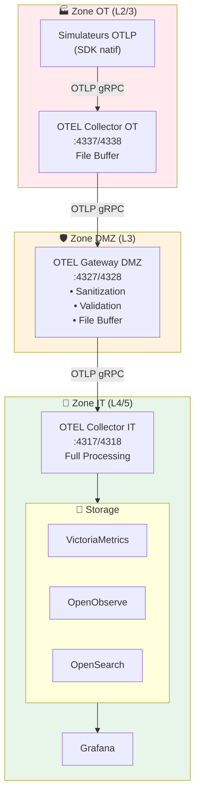
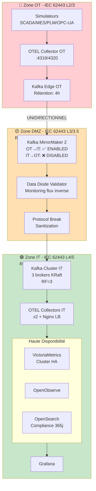
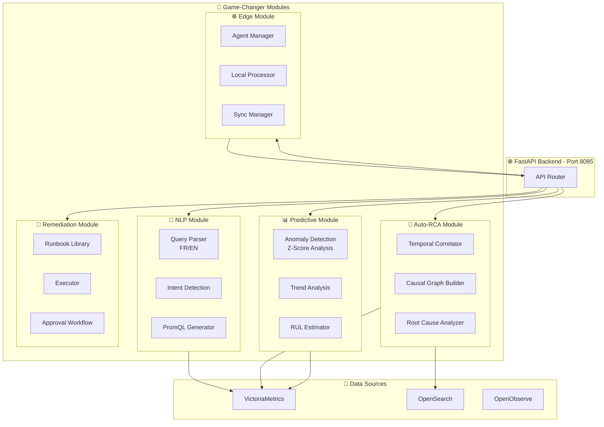
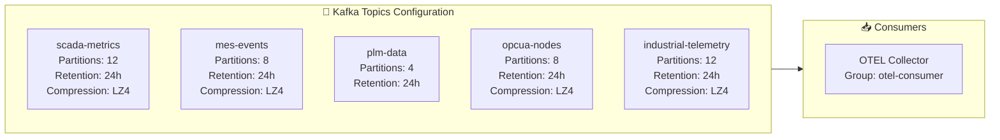
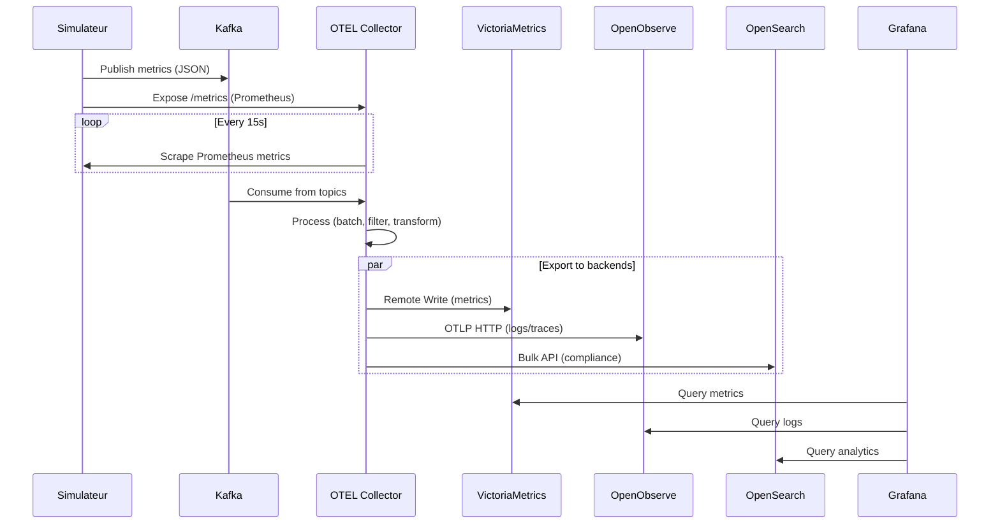
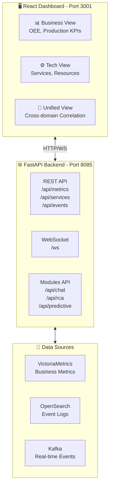

# OOVMTEL - Architecture Technique Complète

## Vue d'Ensemble

OOVMTEL (**O**penObserve + **V**ictoria**M**etrics + Open**TEL**emetry + OpenSearch + Kafka) est une plateforme d'observabilité industrielle haute performance conçue pour les environnements IT/OT critiques.

---

## Architecture Globale

---

## Flux de Données Détaillé

---

## Modes de Déploiement

### Mode 1: Architecture Kafka (Standard)

### Mode 2: Architecture Direct OTLP (Kafka-Free)

### Mode 3: Architecture Sécurisée (IEC 62443)

---

## Composants OpenTelemetry

```mermaid
flowchart LR
    subgraph RECEIVERS["📥 Receivers"]
        R1["otlp<br/>gRPC :4317<br/>HTTP :4318"]
        R2["kafka<br/>industrial-telemetry"]
        R3["prometheus<br/>:9090/metrics"]
        R4["hostmetrics<br/>CPU, Memory, Disk"]
        R5["filelog<br/>/var/log/*.log"]
    end

    subgraph PROCESSORS["⚙️ Processors"]
        P1["batch<br/>10000 items<br/>5s timeout"]
        P2["memory_limiter<br/>2GB limit<br/>1.8GB spike"]
        P3["resourcedetection<br/>docker, system"]
        P4["attributes<br/>add: environment<br/>hash: device_id"]
        P5["transform<br/>context manipulation"]
    end

    subgraph EXPORTERS["📤 Exporters"]
        E1["prometheusremotewrite<br/>→ VictoriaMetrics"]
        E2["otlphttp<br/>→ OpenObserve"]
        E3["opensearch<br/>→ OpenSearch"]
        E4["kafka<br/>→ processed-telemetry"]
    end

    RECEIVERS --> PROCESSORS
    PROCESSORS --> EXPORTERS
```

---

## Architecture des Modules Game-Changer

---

## Tableau des Ports et Services

| Service | Port | Protocole | Description |
|---------|------|-----------|-------------|
| **Kafka** | 9092 | TCP | Bootstrap (interne) |
| **Kafka** | 9093 | TCP | Bootstrap (externe) |
| **OTEL Collector** | 4317 | gRPC | OTLP gRPC receiver |
| **OTEL Collector** | 4318 | HTTP | OTLP HTTP receiver |
| **OTEL Collector** | 8888 | HTTP | Prometheus metrics |
| **OTEL Collector** | 13133 | HTTP | Health check |
| **VictoriaMetrics** | 8428 | HTTP | Query & Ingest API |
| **OpenObserve** | 5080 | HTTP | Web UI & API |
| **OpenSearch** | 9200 | HTTP | REST API |
| **OpenSearch Dashboards** | 5601 | HTTP | Web UI |
| **Grafana** | 3000 | HTTP | Web UI |
| **Kafka UI** | 8090 | HTTP | Web UI |
| **Unified View** | 8085 | HTTP | FastAPI + React |

---

## Configuration des Topics Kafka

---

## Métriques de Performance

| Métrique | Valeur Cible | Description |
|----------|--------------|-------------|
| **Ingestion Rate** | 100k+ pts/sec | Métriques time-series |
| **Log Ingestion** | 50k+ evt/sec | Événements de log |
| **Query Latency (p99)** | < 500ms | Requêtes VictoriaMetrics |
| **Ingestion Latency (p99)** | < 100ms | Pipeline OTEL |
| **Active Time Series** | 1M max | Cardinalité VictoriaMetrics |
| **Metrics Retention** | 90 jours | VictoriaMetrics |
| **Logs Retention** | 7 jours | OpenObserve (temps réel) |
| **Compliance Retention** | 365 jours | OpenSearch |

---

## Comparaison des Modes de Déploiement

| Critère | Kafka Mode | Direct OTLP | Secure (IEC 62443) |
|---------|------------|-------------|---------------------|
| **Complexité** | Moyenne | Faible | Élevée |
| **Mémoire Kafka** | 10.5 GB | 0 GB | 12+ GB |
| **Mémoire OTEL** | 2 GB | 2.75 GB | 4+ GB |
| **Replay des données** | ✅ Oui | ❌ Non | ✅ Oui |
| **Multi-consumer** | ✅ Oui | ❌ Non | ✅ Oui |
| **Sécurité IT/OT** | Moyenne | Moyenne | Très élevée |
| **Conformité IEC 62443** | ❌ Non | ❌ Non | ✅ Oui |
| **Data Diode** | ❌ Non | ❌ Non | ✅ Oui |
| **Cas d'usage** | Standard | POC/Dev | Production critique |

---

## Diagramme de Séquence: Flux de Données

---

## Architecture Unified Business-Tech View

---

## Prochaines Étapes

1. **Kubernetes Deployment** - Helm charts pour production
2. **Hardware Data Diode** - Pour installations critiques
3. **TLS/mTLS** - Chiffrement inter-services
4. **Multi-Datacenter** - Réplication cross-site
5. **GPU Acceleration** - Pour modules AI/ML

---

## Références

- [OpenTelemetry Documentation](https://opentelemetry.io/docs/)
- [VictoriaMetrics Docs](https://docs.victoriametrics.com/)
- [OpenObserve Docs](https://openobserve.ai/docs/)
- [OpenSearch Documentation](https://opensearch.org/docs/)
- [IEC 62443 Standard](https://www.iec.ch/cyber-security)
