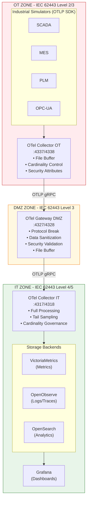
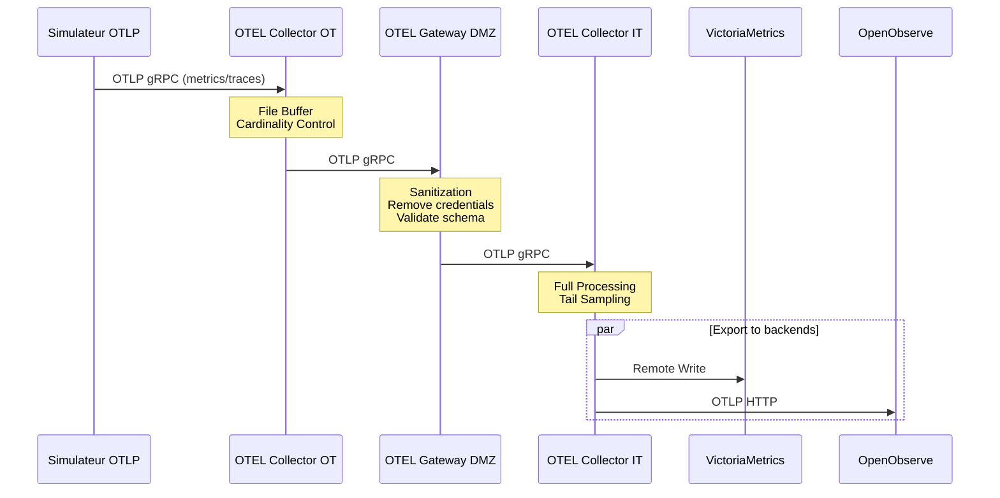
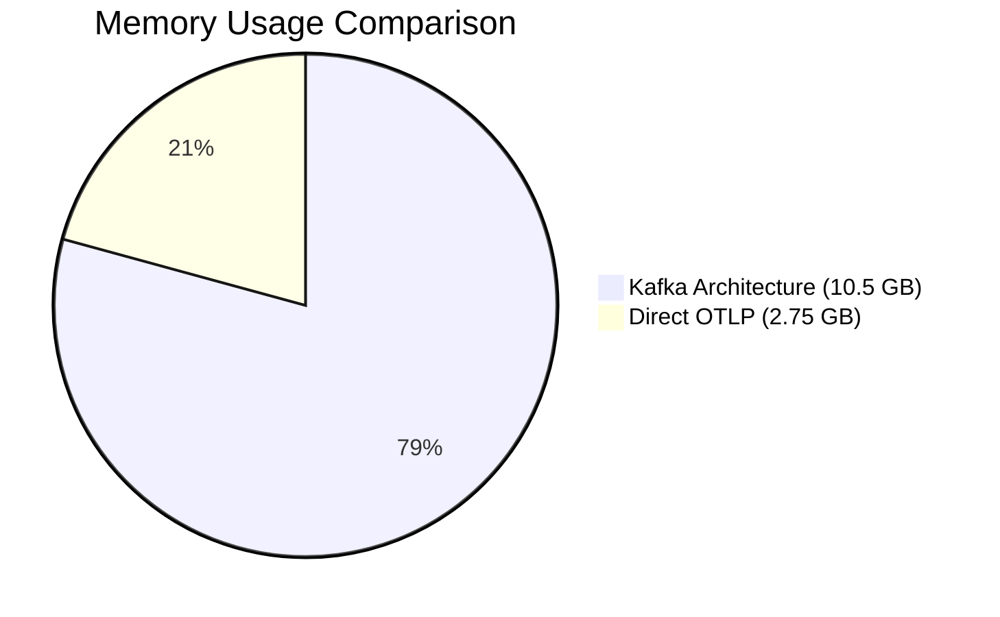
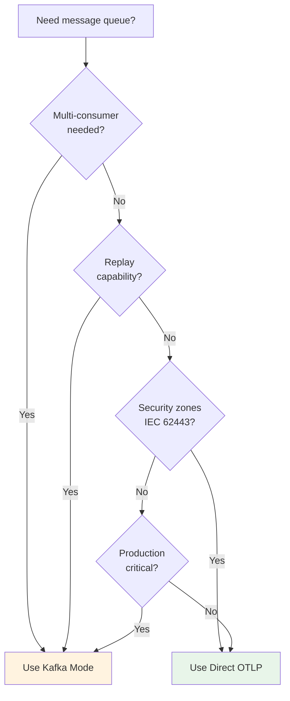

# Direct OTLP Architecture

## Overview

The Direct OTLP architecture eliminates Kafka from the OOVMTEL platform, replacing it with native OpenTelemetry pipelines. This provides a **90% reduction in messaging infrastructure** while maintaining IEC 62443 security zone separation.

## Architecture Diagram



## Flux de Données Détaillé



## Components

### OT Zone

| Component | Purpose | Port |
|-----------|---------|------|
| `scada-simulator` | SCADA data generation with OTLP | 8080 |
| `mes-simulator` | MES events with OTLP | 8081 |
| `plm-simulator` | PLM data with OTLP | 8082 |
| `opcua-simulator` | OPC-UA nodes with OTLP | 8083 |
| `otel-collector-ot` | OT zone collector | 4337 (gRPC), 4338 (HTTP) |

### DMZ Zone

| Component | Purpose | Port |
|-----------|---------|------|
| `otel-gateway-dmz` | Sanitization gateway | 4327 (gRPC), 4328 (HTTP) |

### IT Zone

| Component | Purpose | Port |
|-----------|---------|------|
| `otel-collector-it` | IT zone collector | 4317 (gRPC), 4318 (HTTP) |
| `victoria-metrics` | Metrics storage | 8428 |
| `openobserve` | Logs/traces | 5080 |
| `opensearch` | Analytics | 9200 |
| `grafana` | Dashboards | 3000 |

## Quick Start

```bash
# Start the Direct OTLP architecture
docker-compose -f docker-compose.direct-otlp.yml up -d

# View logs
docker-compose -f docker-compose.direct-otlp.yml logs -f

# Check health
curl http://localhost:13133/health  # IT collector
curl http://localhost:13134/health  # DMZ gateway
curl http://localhost:13135/health  # OT collector

# View metrics
curl http://localhost:8428/api/v1/query?query=scada_temperature_celsius
```

## Resource Comparison

### Before (Kafka Architecture)

| Service | Memory | CPU | Count |
|---------|--------|-----|-------|
| Kafka (main) | 2GB | 1 | 1 |
| Kafka (OT) | 1GB | 0.5 | 1 |
| Kafka (IT cluster) | 2GB | 0.5 | 3 |
| MirrorMaker 2 | 1GB | 0.5 | 1 |
| Kafka UI | 512MB | 0.25 | 1 |
| **Total Kafka** | **10.5GB** | **4.25** | **7** |

### After (Direct OTLP)

| Service | Memory | CPU | Count |
|---------|--------|-----|-------|
| OTel Collector OT | 500MB | 0.25 | 1 |
| OTel Gateway DMZ | 500MB | 0.25 | 1 |
| OTel Collector IT | 1.75GB | 0.5 | 1 |
| **Total OTel** | **2.75GB** | **1** | **3** |

**Savings: 74% memory, 76% CPU, 57% fewer containers**

## Key Features

### 1. File-Based Buffering

Each OTel component uses persistent file storage for reliable message delivery:

```yaml
extensions:
  file_storage/buffer:
    directory: /var/lib/otelcol/buffer
    compaction:
      on_start: true
      on_rebound: true

exporters:
  otlp/downstream:
    sending_queue:
      storage: file_storage/buffer
```

This ensures:
- Data survives container restarts
- Network outages don't cause data loss
- Automatic compaction prevents disk bloat

### 2. Security Zones

The architecture maintains IEC 62443 security levels:

- **OT Zone (L2/3)**: Simulators only communicate with local OTel collector
- **DMZ Zone (L3)**: Gateway sanitizes data, removes credentials/internal IPs
- **IT Zone (L4/5)**: Full processing and storage

### 3. Data Sanitization

The DMZ gateway removes sensitive data:

```yaml
attributes/security_filter:
  actions:
    - key: password
      action: delete
    - key: credential
      action: delete
    - key: internal_ip
      action: delete
    - key: operator_id
      action: hash
```

### 4. Native OTLP Format

Simulators use the OpenTelemetry SDK directly:

```python
from opentelemetry.exporter.otlp.proto.grpc.metric_exporter import OTLPMetricExporter

metric_exporter = OTLPMetricExporter(
    endpoint=OTEL_ENDPOINT,
    insecure=True,
)
```

No format conversion needed (vs. JSON → protobuf with Kafka).

## Configuration Files

| File | Purpose |
|------|---------|
| `docker-compose.direct-otlp.yml` | Main compose file |
| `config/otel/otel-collector-ot-direct.yaml` | OT zone collector |
| `config/otel/otel-gateway-dmz-direct.yaml` | DMZ gateway |
| `config/otel/otel-collector-it-direct.yaml` | IT zone collector |
| `simulators/industrial_simulator_otlp.py` | OTLP simulator |
| `simulators/Dockerfile.otlp` | Simulator container |
| `simulators/requirements-otlp.txt` | Python dependencies |

## Migration from Kafka

### Parallel Running (Recommended)

1. Start Direct OTLP alongside existing Kafka:
   ```bash
   docker-compose -f docker-compose.yml -f docker-compose.direct-otlp.yml up -d
   ```

2. Compare metrics in Grafana between both pipelines

3. Once validated, switch to Direct OTLP only:
   ```bash
   docker-compose -f docker-compose.yml down
   docker-compose -f docker-compose.direct-otlp.yml up -d
   ```

### Clean Migration

```bash
# Stop Kafka architecture
docker-compose down -v

# Start Direct OTLP
docker-compose -f docker-compose.direct-otlp.yml up -d
```

## Monitoring

### OTel Collector Metrics

Each collector exposes Prometheus metrics:

```bash
# OT collector
curl http://localhost:8890/metrics

# DMZ gateway
curl http://localhost:8889/metrics

# IT collector
curl http://localhost:8888/metrics
```

Key metrics:
- `otelcol_exporter_sent_metric_points` - Points sent
- `otelcol_exporter_send_failed_metric_points` - Failed sends
- `otelcol_processor_batch_batch_send_size` - Batch sizes
- `otelcol_exporter_queue_size` - Queue depth

### Health Checks

```bash
# Check all collectors
for port in 13133 13134 13135; do
  echo "Port $port:"
  curl -s http://localhost:$port/health | jq .
done
```

## Troubleshooting

### Data Not Flowing

1. Check OT collector can reach DMZ gateway:
   ```bash
   docker exec oovmtel-otel-collector-ot nc -zv otel-gateway-dmz 4317
   ```

2. Check DMZ gateway can reach IT collector:
   ```bash
   docker exec oovmtel-otel-gateway-dmz nc -zv otel-collector-it 4317
   ```

3. Check file buffers:
   ```bash
   docker exec oovmtel-otel-collector-ot ls -la /var/lib/otelcol/buffer/
   ```

### High Memory Usage

Adjust memory limits in docker-compose:

```yaml
environment:
  GOMEMLIMIT: 500MiB  # Reduce if needed
```

### Buffer Growing

If file buffers grow too large, downstream is unreachable:

```bash
# Check buffer size
docker exec oovmtel-otel-collector-ot du -sh /var/lib/otelcol/buffer/

# Check exporter status
curl http://localhost:8890/metrics | grep exporter
```

## Comparison with Kafka

| Feature | Kafka | Direct OTLP |
|---------|-------|-------------|
| Message persistence | Kafka logs | File-based queue |
| Multi-consumer | Yes | No (push model) |
| Replay capability | Yes | No |
| Format | JSON → protobuf | Native OTLP |
| Operational complexity | High | Low |
| Resource usage | High | Low |
| Best for | Event streaming | Observability |

## Resource Comparison Chart

```mermaid
xychart-beta
    title "Resource Comparison: Kafka vs Direct OTLP"
    x-axis ["Memory (GB)", "CPU (cores)", "Containers"]
    y-axis "Value" 0 --> 12
    bar [10.5, 4.25, 7]
    bar [2.75, 1, 3]
```





## Migration Decision Tree


