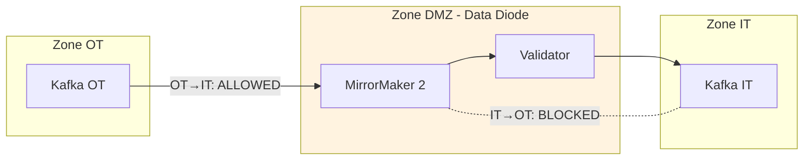
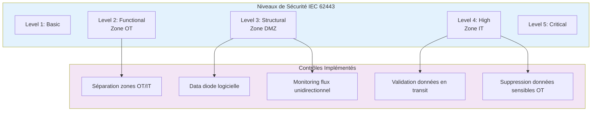
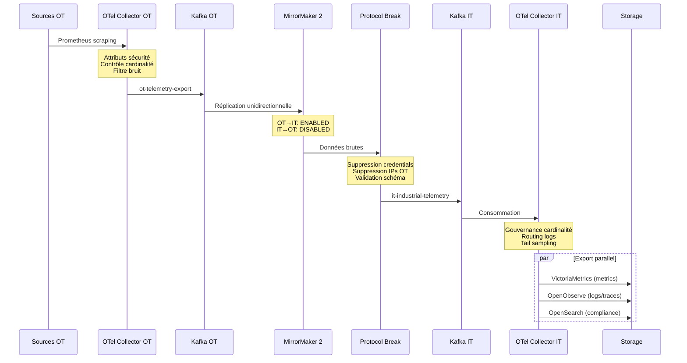
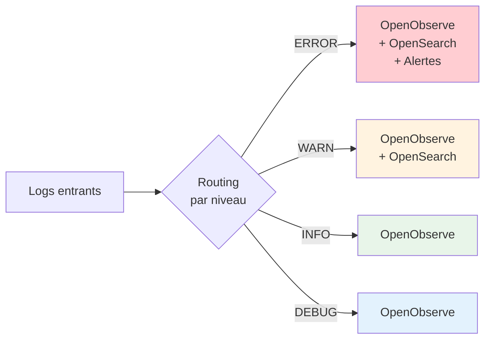
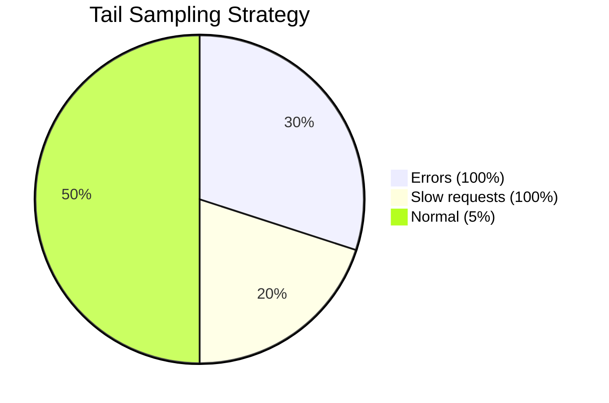

# OOVMTEL - Architecture Sécurisée IT/OT

## Vue d'ensemble

Cette architecture implémente une séparation stricte des zones IT et OT conformément aux standards **IEC 62443** et aux exigences **NIS2**. Elle utilise une approche de **data diode logicielle** pour garantir un flux de données unidirectionnel de l'OT vers l'IT.

## Schéma d'Architecture Principal

```mermaid
flowchart TB
    subgraph OT_ZONE["ZONE OT - IEC 62443 Level 2/3<br/>Réseau: 172.29.0.0/24"]
        direction TB
        subgraph SOURCES["Sources Industrielles"]
            SCADA["SCADA"]
            MES["MES"]
            PLM["PLM"]
            OPCUA["OPC-UA"]
        end
        OTEL_OT["OTel Collector OT<br/>:4319-4320<br/>Minimal footprint"]
        KAFKA_OT["Kafka Edge OT<br/>Rétention: 4h<br/>Buffer local"]

        SOURCES --> OTEL_OT --> KAFKA_OT
    end

    subgraph DMZ_ZONE["ZONE DMZ - IEC 62443 Level 3/3.5<br/>Réseau: 172.30.0.0/24"]
        direction TB
        MM["Kafka MirrorMaker 2<br/>OT → IT: ENABLED<br/>IT → OT: DISABLED"]
        PROTO["Protocol Break<br/>Sanitization<br/>Validation schéma"]
        DIODE["Data Diode Validator<br/>Monitoring flux inverse<br/>Alertes sécurité"]
    end

    subgraph IT_ZONE["ZONE IT - IEC 62443 Level 4/5<br/>Réseau: 172.31.0.0/16"]
        direction TB
        KAFKA_IT["Kafka Cluster IT (HA)<br/>3 brokers KRaft<br/>RF=3, 7j rétention"]
        OTEL_IT["OTel Collectors IT (x2 + LB)<br/>Gouvernance cardinalité<br/>Routing logs intelligent"]

        subgraph STORAGE["Storage Layer"]
            VM_HA["VictoriaMetrics<br/>Cluster HA"]
            OO_IT["OpenObserve<br/>Logs/Traces temps réel"]
            OS_IT["OpenSearch<br/>Compliance 365j"]
        end

        GRAFANA_IT["Grafana<br/>Pipeline Health<br/>AI Observability<br/>Business Views"]

        KAFKA_IT --> OTEL_IT --> STORAGE --> GRAFANA_IT
    end

    KAFKA_OT --> |"UNIDIRECTIONNEL"| MM
    MM --> PROTO --> DIODE --> KAFKA_IT

    style OT_ZONE fill:#ffcdd2,stroke:#c62828
    style DMZ_ZONE fill:#ffe0b2,stroke:#ef6c00
    style IT_ZONE fill:#c8e6c9,stroke:#2e7d32
```



## Data Diode Pattern



## Conformité IEC 62443



## Composants par Zone

### Zone OT (docker-compose.ot.yml)

| Composant | Rôle | Port | Sécurité |
|-----------|------|------|----------|
| kafka-ot | Buffer messages OT (KRaft) | 9094 | Export seul vers DMZ |
| otel-collector-ot | Collecte minimale | 4319-4320, 8889 | Pas de receiver IT |
| scada-simulator | Simulateur SCADA | 8080 | Zone OT uniquement |
| mes-simulator | Simulateur MES | 8081 | Zone OT uniquement |
| plm-simulator | Simulateur PLM | 8082 | Zone OT uniquement |
| opcua-simulator | Simulateur OPC-UA | 8083 | Zone OT uniquement |

### Zone DMZ (docker-compose.dmz.yml)

| Composant | Rôle | Sécurité |
|-----------|------|----------|
| kafka-mirror-maker | Réplication OT→IT | Unidirectionnel configuré |
| data-diode-validator | Surveillance flux | Alertes si violation |
| protocol-break | Sanitization | Supprime données sensibles |

### Zone IT (docker-compose.it.yml)

| Composant | Rôle | Port | HA |
|-----------|------|------|-----|
| kafka-it (x3) | Cluster Kafka KRaft | 9092-9093 | RF=3 |
| vminsert | Ingestion métriques | 8480 | - |
| vmselect | Requêtes métriques | 8481 | - |
| vmstorage (x2) | Stockage métriques | - | RF=2 |
| otel-collector-it (x2) | Pipeline principal | 4317-4318 | LB Nginx |
| openobserve | Logs/traces temps réel | 5080 | - |
| opensearch | Compliance/audit | 9200 | - |
| grafana | Visualisation | 3000 | - |

## Flux de Données

### Vue d'Ensemble des Flux



### Routing des Logs



### Tail Sampling des Traces



## Gouvernance de Cardinalité

### Processeurs OTel

```yaml
# Zone OT - Filtrage agressif
attributes/cardinality_control:
  actions:
    - key: timestamp_raw    action: delete
    - key: request_id       action: delete
    - key: trace_id         action: delete
    - key: uuid             action: delete
    - key: device_id        action: hash

# Zone IT - Filtrage avancé
attributes/cardinality_governance:
  actions:
    - key: request_id       action: delete
    - key: correlation_id   action: delete
    - key: session_id       action: delete
    - key: user_id          action: hash
    - key: device_id        action: hash
    - key: equipment_serial action: hash
```

### Métriques de Monitoring

| Métrique | Seuil Warning | Seuil Critical |
|----------|--------------|----------------|
| Active Time Series | 500,000 | 900,000 |
| New Series/Hour | 10,000 | 50,000 |
| Labels per Series | 30 | 40 |

## Haute Disponibilité

### Kafka IT Cluster (KRaft Mode)

```yaml
Brokers: 3 (combined controller+broker)
Mode: KRaft (no Zookeeper)
Replication Factor: 3
Min In-Sync Replicas: 2
Partitions par topic: 4-12
```

### VictoriaMetrics Cluster

```yaml
vminsert: 1 instance
vmselect: 1 instance
vmstorage: 2 instances (RF=2)
```

### OTel Collectors IT

```yaml
Instances: 2
Load Balancer: Nginx
Health Checks: /health (13133)
Failover: automatic
```

## Stockage Logs - Rationalisation

| Destination | Cas d'usage | Rétention | Format |
|-------------|-------------|-----------|--------|
| **OpenObserve** | Temps réel, debugging, recherche rapide | 7 jours | OTLP natif |
| **OpenSearch** | Compliance, audit, analytics avancée | 365 jours | ECS |

### Routing Intelligent

```yaml
routing/logs:
  ERROR → OpenObserve + OpenSearch + Kafka Alerts
  WARN  → OpenObserve + OpenSearch
  INFO  → OpenObserve seul
  DEBUG → OpenObserve seul
```

## AI Observability Extension

### Métriques Capturées

| Catégorie | Métriques |
|-----------|-----------|
| Inference | `inference_latency_milliseconds`, `inference_requests_total`, `inference_errors_total` |
| Model Performance | `model_confidence_score`, `drift_score`, `concept_drift_score` |
| Token Usage (LLM) | `token_usage_input_total`, `token_usage_output_total`, `llm_cost_usd_total` |
| Resources | `gpu_utilization_percent`, `gpu_memory_used_bytes`, `batch_size` |

### Configuration

```yaml
# config/otel/otel-collector-ai-config.yaml
receivers:
  otlp/ai:
    protocols:
      grpc: 0.0.0.0:4319
      http: 0.0.0.0:4320
  kafka/ai:
    topic: ai-inference-metrics
```

## Déploiement

### Mode Développement (Single Compose)

```bash
# Utiliser le docker-compose.yml original
docker-compose up -d
```

### Mode Production (Architecture Sécurisée)

```bash
# 1. Démarrer la zone OT
docker-compose -f docker-compose.ot.yml up -d

# 2. Créer le réseau DMZ
docker network create oovmtel_dmz-network

# 3. Démarrer la DMZ
docker-compose -f docker-compose.dmz.yml up -d

# 4. Démarrer la zone IT
docker-compose -f docker-compose.it.yml up -d
```

### Vérification

```bash
# Vérifier que les topics OT ne sont pas dans IT (inversement)
docker exec oovmtel-kafka-it-1 kafka-topics --list --bootstrap-server localhost:9092 | grep "^ot-"
# Doit retourner vide

# Vérifier le flux unidirectionnel
docker logs oovmtel-data-diode-validator
```

## Dashboards Grafana

| Dashboard | UID | Description |
|-----------|-----|-------------|
| Pipeline Health | `oovmtel-pipeline-health` | Santé du pipeline d'observabilité |
| AI Observability | `oovmtel-ai-observability` | Monitoring workloads AI/ML |
| Unified Business-Tech | `unified-business-tech-view` | Vue métier et technique |

## Conformité

### IEC 62443

- [x] Séparation zones OT/IT
- [x] Data diode logicielle
- [x] Monitoring flux unidirectionnel
- [x] Validation données en transit
- [x] Suppression données sensibles OT

### NIS2

- [x] Logs d'audit (OpenSearch, rétention 365j)
- [x] Traçabilité des accès
- [x] Monitoring sécurité continu
- [x] Documentation architecture

## Évolutions Futures

1. **Hardware Data Diode**: Pour installations critiques
2. **TLS/mTLS**: Chiffrement inter-services
3. **SASL/SCRAM**: Authentification Kafka
4. **Vault Integration**: Gestion secrets
5. **Multi-site**: Réplication cross-datacenter
