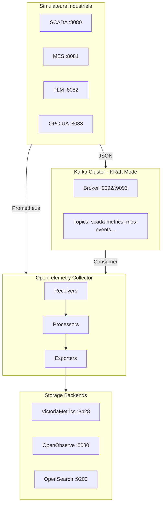
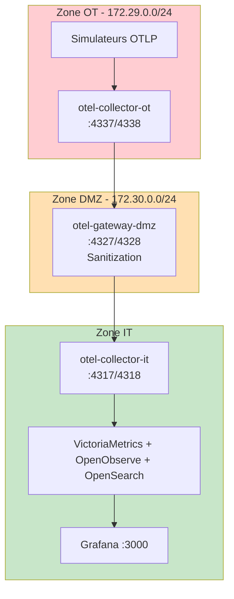
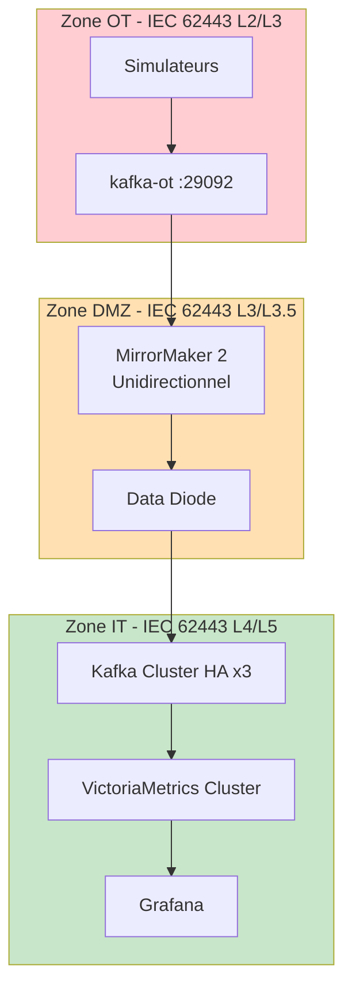

# Modes de Déploiement

OOVMTEL supporte trois modes de déploiement adaptés à différents cas d'usage.

## Vue Comparative

| Critère | Standard (Kafka) | Direct-OTLP | Secure (IEC 62443) |
|---------|------------------|-------------|---------------------|
| **Complexité** | Moyenne | Faible | Élevée |
| **RAM totale** | ~15 GB | ~5 GB | ~25 GB |
| **Replay données** | 24h | Non | 7j+ |
| **Multi-consumer** | Oui | Non | Oui |
| **Séparation IT/OT** | Non | Logique | Physique |
| **Data Diode** | Non | Non | Oui |
| **Conformité** | - | - | IEC 62443 |
| **Cas d'usage** | Dev/Test | POC | Production critique |

## Mode 1: Standard (Kafka)

**Fichier:** `docker-compose.yml`



### Services (13)

| Service | Port | Rôle |
|---------|------|------|
| kafka | 9092/9093 | Message broker |
| victoria-metrics | 8428 | Time series DB |
| vmagent | 8429 | Prometheus scraper |
| openobserve | 5080 | Logs & traces |
| opensearch | 9200 | Full-text search |
| opensearch-dashboards | 5601 | Analytics UI |
| otel-collector | 4317/4318 | Telemetry pipeline |
| grafana | 3000 | Dashboards |
| unified-view | 8085 | Business-Tech view |
| scada-simulator | 8080 | SCADA data gen |
| mes-simulator | 8081 | MES data gen |
| plm-simulator | 8082 | PLM data gen |
| opcua-simulator | 8083 | OPC-UA data gen |

### Démarrage

```bash
docker compose up -d
# ou
./scripts/start.sh simple
```

---

## Mode 2: Direct-OTLP (Sans Kafka)

**Fichier:** `docker-compose.direct-otlp.yml`



### Avantages

- 90% moins de ressources (pas de Kafka)
- OTLP end-to-end
- File-based buffering (persistance)
- Séparation IT/OT/DMZ

### Démarrage

```bash
docker compose -f docker-compose.direct-otlp.yml up -d
# ou
./scripts/start.sh direct-otlp
```

---

## Mode 3: Secure (IEC 62443)

**Fichiers:**
- `docker-compose.ot.yml` - Zone OT
- `docker-compose.dmz.yml` - Zone DMZ
- `docker-compose.it.yml` - Zone IT



### Conformité IEC 62443

| Zone | Niveau | Réseau | Composants |
|------|--------|--------|------------|
| OT | L2/L3 | 172.29.0.0/24 | Simulateurs, Kafka-OT, OTEL-OT |
| DMZ | L3/L3.5 | 172.30.0.0/24 | MirrorMaker, Data Diode, Protocol Break |
| IT | L4/L5 | 172.31.0.0/16 | Kafka HA, VM Cluster, Grafana |

### Démarrage

```bash
./scripts/start.sh secure
```

---

## Ressources Système

| Mode | RAM Min | RAM Recommandée | CPU | Disque |
|------|---------|-----------------|-----|--------|
| Standard | 16 GB | 32 GB | 4 cores | 100 GB |
| Direct-OTLP | 8 GB | 16 GB | 2 cores | 50 GB |
| Secure | 32 GB | 64 GB | 8 cores | 200 GB |

### Détail par Service

| Service | RAM | CPU |
|---------|-----|-----|
| Kafka | 4-8 GB | 1-2 |
| VictoriaMetrics | 2-4 GB | 0.5-1 |
| OpenObserve | 1-2 GB | 0.5-1 |
| OpenSearch | 4-8 GB | 1-2 |
| OTEL Collector | 2-4 GB | 0.5-1 |
| Grafana | 512 MB | 0.2 |
| Simulators | 256 MB each | 0.1 |

## Références

- [Vue d'ensemble](SYSTEM_OVERVIEW.md)
- [Architecture sécurisée détaillée](../SECURE_ARCHITECTURE.md)
- [Pipelines OpenTelemetry](OTEL_PIPELINES.md)
