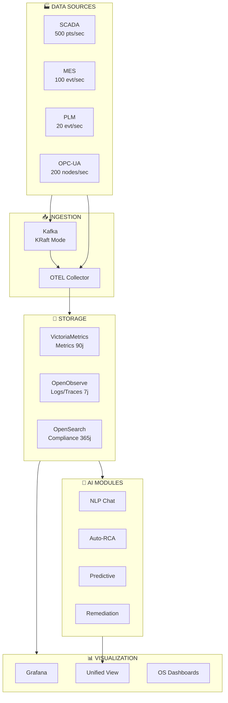
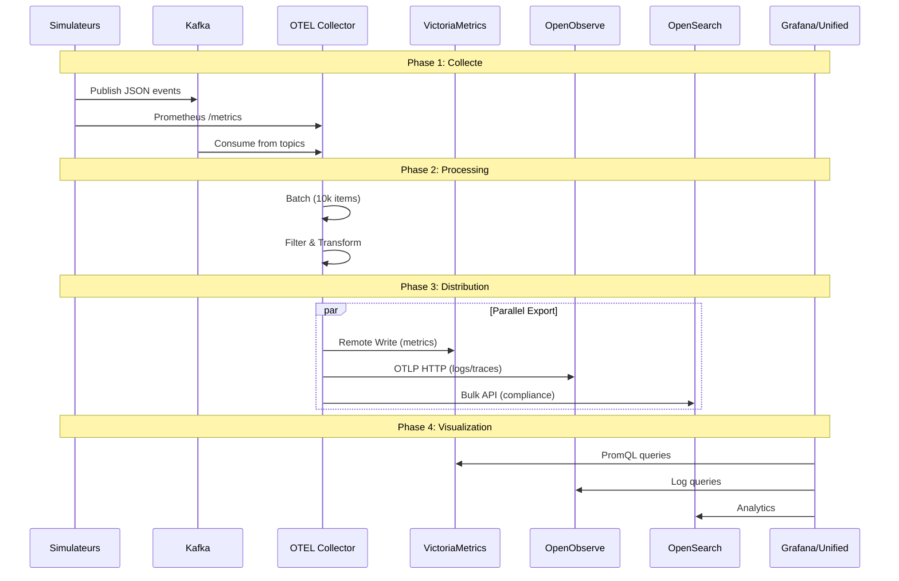
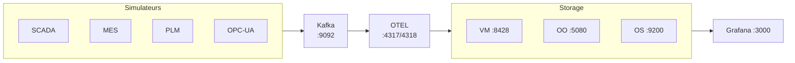
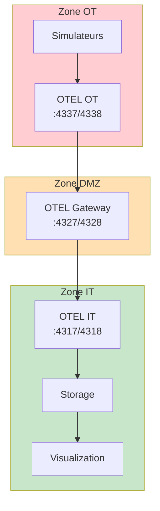
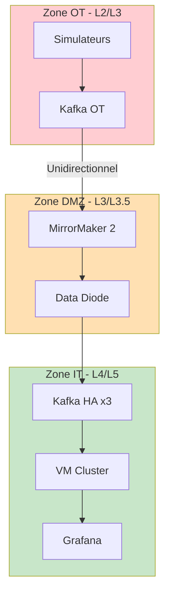
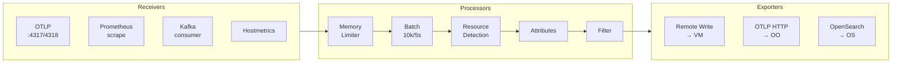
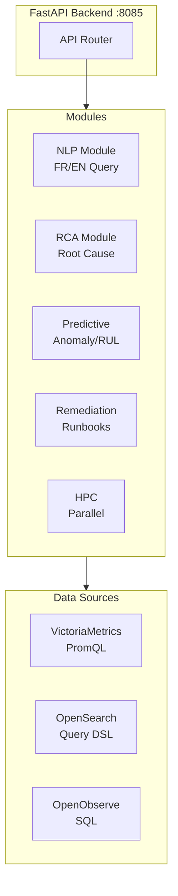
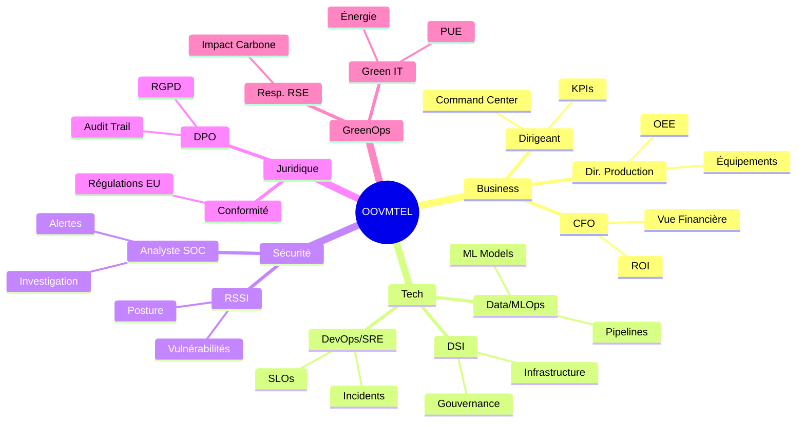
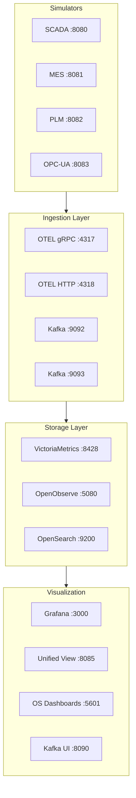

# Diagrammes d'Architecture OOVMTEL

Collection de diagrammes Mermaid pour visualiser l'architecture de la plateforme.

> **Tip:** Ces diagrammes sont au format Mermaid et peuvent être rendus par GitHub, GitLab, et la plupart des outils de documentation modernes.

---

## 1. Architecture Globale

---

## 2. Flux de Données

---

## 3. Modes de Déploiement

### Mode Standard

### Mode Direct-OTLP

### Mode Sécurisé (IEC 62443)

---

## 4. Pipeline OTEL

---

## 5. Modules Game-Changer

---

## 6. Architecture des Personas

---

## 7. Réseau et Ports

---

## Utilisation des Diagrammes

Ces diagrammes peuvent être :

1. **Rendus par GitHub/GitLab** - Visualisation directe dans le repository
2. **Exportés en images** - Via [Mermaid Live Editor](https://mermaid.live/)
3. **Intégrés dans des présentations** - Export PNG/SVG
4. **Utilisés dans la documentation** - MkDocs, Docusaurus, etc.

## Outils Recommandés

- [Mermaid Live Editor](https://mermaid.live/) - Éditeur en ligne
- [VS Code Mermaid Extension](https://marketplace.visualstudio.com/items?itemName=bierner.markdown-mermaid) - Preview dans VS Code
- [mermaid-cli](https://github.com/mermaid-js/mermaid-cli) - Génération d'images en ligne de commande
