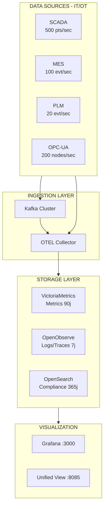

# Vue d'Ensemble Système

**OOVMTEL** = **O**penObserve + **V**ictoria**M**etrics + Open**TEL**emetry + OpenSearch + Kafka

Plateforme d'observabilité industrielle haute performance pour environnements IT/OT critiques.

## Architecture Globale

```
┌─────────────────────────────────────────────────────────────────────────┐
│                            OOVMTEL PLATFORM                              │
├─────────────────────────────────────────────────────────────────────────┤
│                                                                          │
│  ┌───────────────────────────────────────────────────────────────────┐  │
│  │                     DATA SOURCES (IT/OT Layer)                     │  │
│  │  ┌────────┐  ┌────────┐  ┌────────┐  ┌────────┐  ┌────────────┐   │  │
│  │  │ SCADA  │  │  MES   │  │  PLM   │  │ OPC-UA │  │ IT Systems │   │  │
│  │  │ 500/s  │  │ 100/s  │  │  20/s  │  │ 200/s  │  │            │   │  │
│  │  └───┬────┘  └───┬────┘  └───┬────┘  └───┬────┘  └─────┬──────┘   │  │
│  └──────┼──────────┼──────────┼──────────┼───────────────┼───────────┘  │
│         │          │          │          │               │              │
│         ▼          ▼          ▼          ▼               ▼              │
│  ┌───────────────────────────────────────────────────────────────────┐  │
│  │                        INGESTION LAYER                             │  │
│  │  ┌─────────────────────────┐    ┌─────────────────────────────┐   │  │
│  │  │     KAFKA CLUSTER       │    │   OPENTELEMETRY COLLECTOR   │   │  │
│  │  │     (KRaft Mode)        │    │                             │   │  │
│  │  │  • scada-metrics (12p)  │    │  Receivers: OTLP, Prometheus│   │  │
│  │  │  • mes-events (8p)      │───►│  Processors: Batch, Filter  │   │  │
│  │  │  • plm-data (4p)        │    │  Exporters: VM, OO, OS      │   │  │
│  │  └─────────────────────────┘    └──────────────┬──────────────┘   │  │
│  └────────────────────────────────────────────────┼──────────────────┘  │
│                                                    │                     │
│  ┌────────────────────────────────────────────────┼──────────────────┐  │
│  │                        STORAGE LAYER           │                   │  │
│  │  ┌─────────────────┐  ┌─────────────────┐  ┌───┴───────────────┐  │  │
│  │  │ VICTORIAMETRICS │  │   OPENOBSERVE   │  │    OPENSEARCH     │  │  │
│  │  │  Time Series    │  │   Logs/Traces   │  │  Full-text/Audit  │  │  │
│  │  │  :8428 / 90j    │  │   :5080 / 7j    │  │  :9200 / 365j     │  │  │
│  │  └─────────────────┘  └─────────────────┘  └───────────────────┘  │  │
│  └───────────────────────────────────────────────────────────────────┘  │
│                                                                          │
│  ┌───────────────────────────────────────────────────────────────────┐  │
│  │                      VISUALIZATION LAYER                           │  │
│  │  ┌─────────┐  ┌────────────────┐  ┌────────────┐  ┌────────────┐  │  │
│  │  │ GRAFANA │  │ OS Dashboards  │  │Unified View│  │  Kafka UI  │  │  │
│  │  │ :3000   │  │    :5601       │  │   :8085    │  │   :8090    │  │  │
│  │  └─────────┘  └────────────────┘  └────────────┘  └────────────┘  │  │
│  └───────────────────────────────────────────────────────────────────┘  │
│                                                                          │
└─────────────────────────────────────────────────────────────────────────┘
```

## Schéma Mermaid



## Modules Game-Changer

```
┌───────────┐  ┌───────────┐  ┌───────────┐  ┌───────────┐  ┌───────────┐
│    NLP    │  │  AUTO-RCA │  │ PREDICTIVE│  │REMEDIATION│  │    HPC    │
│   CHAT    │  │           │  │           │  │           │  │           │
│  FR/EN    │  │Root Cause │  │ Anomaly   │  │ Runbook   │  │ Parallel  │
│ PromQL Gen│  │ Analysis  │  │ Detection │  │ Executor  │  │ Processing│
└───────────┘  └───────────┘  └───────────┘  └───────────┘  └───────────┘
```

## Services et Ports Principaux

| Service | Port | Rôle |
|---------|------|------|
| Grafana | 3000 | Dashboards métriques |
| OTEL Collector | 4317/4318 | Telemetry pipeline |
| OpenObserve | 5080 | Logs & traces |
| OpenSearch Dashboards | 5601 | Analytics UI |
| Unified View | 8085 | Business-Tech view |
| VictoriaMetrics | 8428 | Time series DB |
| Kafka UI | 8090 | Kafka management |
| Kafka | 9092/9093 | Message broker |
| OpenSearch | 9200 | Full-text search |

## Accès aux Services

| Service | URL | Credentials |
|---------|-----|-------------|
| Unified View | http://localhost:8085 | - |
| Grafana | http://localhost:3000 | admin / admin123 |
| OpenObserve | http://localhost:5080 | root@example.com / Complexpass#123 |
| OpenSearch Dashboards | http://localhost:5601 | - |
| Kafka UI | http://localhost:8090 | - |

## Références

- [Modes de déploiement](DEPLOYMENT_MODES.md)
- [Pipelines OpenTelemetry](OTEL_PIPELINES.md)
- [Ports et réseau](NETWORK_PORTS.md)
- [Stockage](STORAGE.md)
